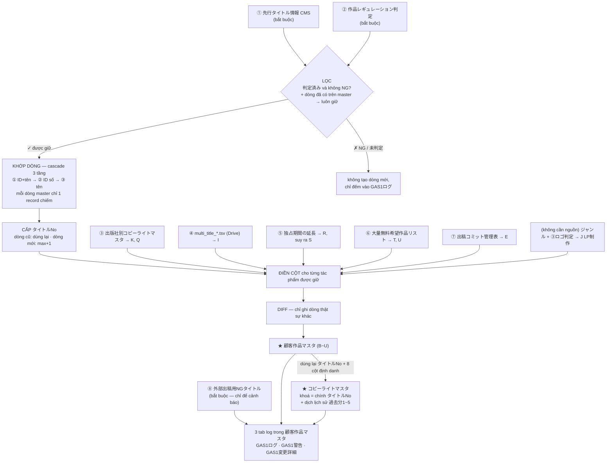
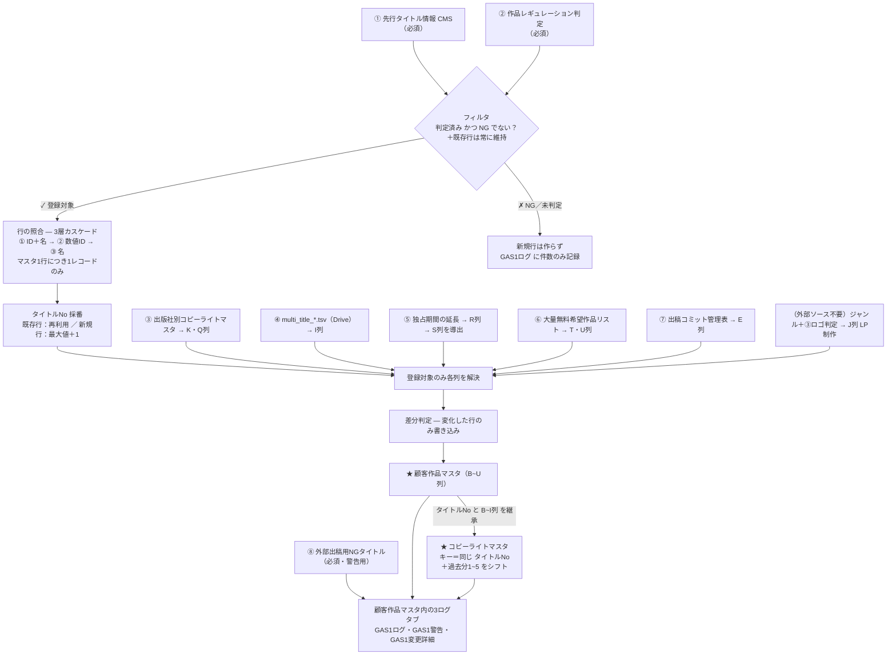

# GAS❶ — Mô tả hiện trạng (bản 2026-08-13)

Bản này mô tả **code đang có trên branch `regulation-filter-cascade-key`**, không phải spec.
Mọi bản mô tả trước ngày này đã lỗi thời — bỏ qua.

**Một câu:** GAS❶ đọc 7 nguồn (chỉ đọc), lọc tác phẩm theo レギュレーション, rồi ghi
**2 master** + **3 tab log**. Chạy tự động **9h và 17h** giờ Nhật, hoặc chạy tay
`runGas1()` trong Apps Script editor.

> 日本語版は下半分（「【日本語版】」以降）にあります。内容は同一です。

---

# PHẦN A — TIẾNG VIỆT

## A1. Hình quy trình

## A2. Bảy nguồn đầu vào (chỉ ĐỌC, không sửa gì)

| # | Nguồn | Cấp cột nào | Loại | Trạng thái |
|---|---|---|---|---|
| ① | `先行タイトル情報 (CMS)` | thông tin tác phẩm + bản quyền cột J | **Bắt buộc** | OK |
| ② | `作品レギュレーション判定` | **bộ lọc** + 3 cột phán định ①②③ | **Bắt buộc** | OK |
| ⑧ | `外部出稿用NGタイトル` | không ghi cột nào — chỉ sinh cảnh báo | **Bắt buộc** | OK |
| ③ | `出版社別コピーライトマスタ` | K 出版社コピーライト, Q 出版社事前確認 | Phụ | OK |
| ④ | `multi_title_yyyyMMdd.tsv` (Drive) | I 掲載停止日付 | Phụ | OK |
| ⑤ | `【先行作品】独占期間の延長` | R 先行終了日（延長）→ suy ra S | Phụ | OK |
| ⑥ | `大量無料希望作品リスト_CA様` | T/U 大量無料開始日・終了日 | Phụ | ⚠️ **chưa có spreadsheetId** |
| ⑦ | `出稿コミット管理表` | E タイトル区分 | Phụ | ⚠️ **chưa có spreadsheetId** |

**"Phụ"** = đọc không được (mất quyền / đổi tên sheet / chưa có ID) thì **lần chạy vẫn
tiếp tục**, cột tương ứng **giữ nguyên giá trị đang có** (không bị xoá), và lý do được
ghi 1 dòng vào `GAS1警告`.

⚠️ Với ⑥ và ⑦: chỉ cần điền `spreadsheetId` vào `src/config.js` là tự kích hoạt,
không phải sửa code.

## A3. Mười hai bước của `runGas1()`

| Bước | Làm gì |
|---|---|
| 1 | Đọc + parse 7 nguồn (mỗi nguồn phụ có `try/catch` riêng) |
| 2 | Build lookup レギュレーション: chỉ dòng `判定済み`, tên trùng thì **NG thắng** |
| 3 | Gắn 3 cột phán định vào từng tác phẩm CMS (chưa lọc) |
| 4 | Đọc `顧客作品マスタ` hiện có (**phải trước bước 5**) |
| 5 | **Lọc + khớp dòng cùng một lượt** (cascade 3 tầng) |
| 6 | Điền các cột phái sinh cho **chỉ tác phẩm được giữ**: K, Q, I, R, S, T, U, E, J |
| 7 | Cấp / dùng lại `タイトルNo` |
| 8 | Diff → ghi `顧客作品マスタ` + đóng dấu `更新日` |
| 9 | Build `コピーライトマスタ` theo `タイトルNo`, dịch lịch sử → ghi + `更新日` |
| 10 | Ghi `GAS1変更詳細` (1 dòng / 1 field đã đổi, có giá trị trước–sau) |
| 11 | Ghi `GAS1警告` (12 loại) |
| 12 | Slack nếu có tác phẩm không có bản quyền nào → ghi `GAS1ログ` (luôn chạy, kể cả khi lỗi) |

Nếu bất kỳ bước nào lỗi: log + Slack + **re-throw** → lần chạy hiện rõ là THẤT BẠI và
**chưa kịp ghi gì lên 2 master** (2 lệnh ghi nằm sau).

## A4. Bốn kiểu ghi cột — điểm dễ nhầm nhất

| Kiểu | Cột | Hành vi |
|---|---|---|
| **Ghi đè mỗi lần** | CMS (`CMS ID`, `タイトルID`, `タイトル名`, `作家名`, `ジャンル`, `出版社`, `レーベル名`, `先行開始日`, `先行終了日`), ①②③, **E**, **R**, **S**, **T**, **U**, và J/K/Q của `コピーライトマスタ` | Nguồn là nơi duy nhất đúng. Giá trị gõ tay khác nguồn **sẽ bị thay**. Tác phẩm bị rút khỏi nguồn → ô bị **xoá** (đúng ý: hạn độc quyền hết hiệu lực không được giữ lại) |
| **Ghi một lần** | **I** `掲載停止日付` | Chỉ điền khi ô **đang trống**. Đã có chữ (dù GAS ghi hay người gõ) thì **không bao giờ ghi đè** |
| **Ghi có điều kiện** | **J** `LP制作` | Tính ra `必要`/`不要` thì ghi đè; tính ra rỗng (未判定) thì **giữ nguyên ô** — không xoá chữ 営業 gõ tay |
| **Không đụng** | cột A (đệm) và **mọi cột được thêm sau này** | Khi ghi đè 1 dòng, GAS dựng lại từ dòng cũ nên các cột nó không sở hữu được bảo toàn nguyên vẹn |

GAS đọc/ghi theo **tên cột**, không theo chữ cái → chèn hoặc di chuyển cột vẫn chạy;
**đổi tên hoặc xoá cột thì không**.

## A5. Hai quy tắc phái sinh (tính trong code, không có nguồn riêng)

**Cột E `タイトル区分`** — join theo `タイトル名` với `出稿コミット管理表`:
có dòng nào mang `2.先行配信（出稿コミット）` → `コミット`, còn lại → `独占`.
Không bao giờ trống.

**Cột J `LP制作`** — xét theo đúng thứ tự này (thứ tự là phần của quy tắc):

1. `ジャンル` bắt đầu bằng `TL` / `BL` → **必要** (bỏ qua ロゴ判定)
2. còn lại, `③シーモアロゴ判定` = `ロゴなし` → **必要**
3. còn lại, = `ロゴあり` → **不要**
4. còn lại (未判定) → **rỗng** = giữ nguyên ô + 1 dòng `LP制作注意`

**Cột S `先行終了日（最終確定）`** = R nếu R có ngày, ngược lại = Q.

## A6. Khoá — cách GAS biết "tác phẩm này là dòng nào"

**Cascade 3 tầng, dừng ở tầng đầu tiên khớp**, mỗi dòng master chỉ 1 record được chiếm:

1. `タイトルID` + `タイトル名` (bình thường)
2. `タイトルID` dạng số (bắt ca **đổi tên**)
3. `タイトル名` (bắt ca **ID trống → có số**)

Khớp được → dòng CŨ, dùng lại `タイトルNo` đang có. Không khớp → dòng MỚI, `タイトルNo` = max + 1.
`CMS ID` **không** dùng làm khoá (chỉ để tra ngược khi điều tra sự cố).

`コピーライトマスタ` **không có khoá riêng** — nó dùng chính `タイトルNo` của
`顧客作品マスタ`, nên bước 7 buộc phải chạy trước bước 9.

## A7. Ba thứ tự không được đảo

1. **Đọc master cũ → rồi mới lọc.** Tác phẩm đã có trên master thì **luôn được giữ**, kể cả sau này bị NG (`削除等はしない`).
2. **Lọc → rồi mới cấp số.** Tác phẩm bị loại không được chiếm `タイトルNo`.
3. **Cấp số → rồi mới build `コピーライトマスタ`.**

## A8. Bản quyền của `コピーライトマスタ`

| Cột | Nguồn | Quy tắc |
|---|---|---|
| J `タイトル個別コピーライト` | ① CMS | copy **nguyên văn** |
| K `出版社コピーライト` | ③ | GAS **sinh lại mỗi lần chạy**: tra quy tắc theo (出版社 + レーベル) rồi (出版社), điền template |
| Q `出版社事前確認` | ③ | nguyên văn `必要`/`不要`. ガワ chưa có cột này thì GAS **bỏ qua**, thêm cột là tự kích hoạt |
| `コピーライト_過去分1〜5` | giá trị cũ | bản quyền **hiệu lực** (J ưu tiên, không thì K) **thật sự đổi** thì dịch xuống 1 bậc; quá 5 thì xoá |

**K để trống trong 3 trường hợp** — không đoán, để trống + ghi cảnh báo (gộp theo NXB,
sửa 1 dòng quy tắc là cả NXB được giải quyết):

| Lý do | Xử lý |
|---|---|
| `ルール無し` — NXB không có dòng quy tắc | thêm dòng cho NXB đó |
| `個別ルール` — cờ tự động là `02：個別ルール` | viết tay (đúng spec) |
| `テンプレート不備` — template là câu chỉ dẫn, hoặc chứa placeholder CMS không điền được | sửa template |

Cả J và K đều trống → tác phẩm là **個別対応**, được báo Slack.

## A9. Ba tab log (nằm trong spreadsheet `顧客作品マスタ`)

| Tab | Mỗi dòng là | Trả lời câu hỏi |
|---|---|---|
| `GAS1ログ` | 1 lần chạy | "hôm nay có ổn không" |
| `GAS1警告` | 1 cảnh báo (12 loại) | "có gì cần người nhìn" |
| `GAS1変更詳細` | 1 field đã đổi | "giá trị cũ là gì" |

12 loại cảnh báo: `照合注意` · `照合曖昧` · `孤立行` · `外部出稿NG注意` · `掲載停止注意` ·
`コピーライト注意` · `先行延長注意` · `大量無料注意` · `タイトル区分注意` · `LP制作注意` ·
`出版社事前確認注意` · `更新日注意`.

Cả 2 master còn được đóng dấu `更新日` = thời điểm chạy, **dùng chung một mốc** với
`GAS1警告` và `GAS1変更詳細` để 3 nơi đối chiếu được với nhau.

## A10. Tác phẩm bị loại

Tác phẩm không `判定済み`, hoặc bị NG → **không được thêm mới** vào master.
Nhưng **dòng đã tồn tại thì không bị xoá** (`削除等はしない`) — chỉ 3 cột ①②③ được cập nhật.

Số lượng xem `除外_NG件数` / `除外_未判定件数` trong `GAS1ログ`.
Cần **danh sách** thì chạy `probe_dryRunFilter()` (chỉ đọc, không ghi gì lên sheet).

## A11. Việc còn thiếu

- `spreadsheetId` của ⑥ `大量無料希望作品リスト_CA様` và ⑦ `出稿コミット管理表` → T/U và E đang đứng yên
- Cột Q `出版社事前確認` trên ガワ của `コピーライトマスタ` (nếu chưa thêm)
- `旧情報アーカイブ` — ngoài phạm vi, chưa cài đặt
- `encoding` của file TSV chưa xác nhận bằng mắt (đang để `UTF-8`; chạy `probe_dumpSuspensionTsv()` để so)

---

# 【日本語版】GAS❶ 現状仕様（2026-08-13 版）

本ドキュメントは**ブランチ `regulation-filter-cascade-key` の現行コード**を記述したもので、
仕様書ではありません。本日より前の説明資料はすべて古いため無効です。

**一文で:** GAS❶ は 7 つのソースを**読み取り専用**で参照し、レギュレーション判定で
絞り込んだうえで **2 つのマスタ**と **3 つのログタブ**に書き込みます。毎日
**9時・17時**（日本時間）に自動実行、または Apps Script エディタから `runGas1()` を手動実行します。

## 1. 処理フロー図

## 2. 入力ソース7件（読み取りのみ・一切書き込みません）

| # | ソース | 提供する列 | 区分 | 状態 |
|---|---|---|---|---|
| ① | `先行タイトル情報 (CMS)` | 作品情報＋J列コピーライト | **必須** | OK |
| ② | `作品レギュレーション判定` | **フィルタ**＋判定列 ①②③ | **必須** | OK |
| ⑧ | `外部出稿用NGタイトル` | 列への書き込みなし・警告のみ | **必須** | OK |
| ③ | `出版社別コピーライトマスタ` | K列 出版社コピーライト／Q列 出版社事前確認 | 補助 | OK |
| ④ | `multi_title_yyyyMMdd.tsv`（Drive） | I列 掲載停止日付 | 補助 | OK |
| ⑤ | `【先行作品】独占期間の延長` | R列 先行終了日（延長）→ S列を導出 | 補助 | OK |
| ⑥ | `大量無料希望作品リスト_CA様` | T・U列 大量無料開始日・終了日 | 補助 | ⚠️ **spreadsheetId 未設定** |
| ⑦ | `出稿コミット管理表` | E列 タイトル区分 | 補助 | ⚠️ **spreadsheetId 未設定** |

**「補助」**とは、読み込みに失敗しても（権限喪失・シート名変更・ID 未設定）
**処理全体は継続**し、該当列は**現在の値がそのまま保持**され（消去されません）、
理由が `GAS1警告` に1行記録される、という意味です。

⚠️ ⑥⑦ は `src/config.js` に `spreadsheetId` を入れるだけで自動的に有効化されます
（コード修正は不要）。

## 3. `runGas1()` の12ステップ

| # | 処理 |
|---|---|
| 1 | 7ソースの読み込み・パース（補助ソースは個別に `try/catch`） |
| 2 | レギュレーション lookup 構築：`判定済み` のみ、同名は **NG 優先** |
| 3 | CMS 全作品に判定列を付与（この時点では未フィルタ） |
| 4 | 既存 `顧客作品マスタ` の読み込み（**ステップ5より前が必須**） |
| 5 | **フィルタと行の照合を同一パスで実行**（3層カスケード） |
| 6 | **登録対象のみ**の派生列を解決：K・Q・I・R・S・T・U・E・J |
| 7 | `タイトルNo` の採番／再利用 |
| 8 | 差分判定 → `顧客作品マスタ` 書き込み ＋ `更新日` 記入 |
| 9 | `タイトルNo` をキーに `コピーライトマスタ` 構築・履歴シフト → 書き込み ＋ `更新日` |
| 10 | `GAS1変更詳細` 記録（1行＝1項目の変更・変更前後の値付き） |
| 11 | `GAS1警告` 記録（12種別） |
| 12 | コピーライト特定不可があれば Slack 通知 → `GAS1ログ` 記録（エラー時も必ず実行） |

いずれかのステップで例外が発生した場合：ログ＋Slack 通知の後に **re-throw** します。
実行が明確に**失敗**として記録され、かつ**2つのマスタには何も書き込まれません**
（書き込み処理は例外発生箇所より後にあるため）。

## 4. 列の書き込み方式は4種類（最も誤解しやすい点）

| 方式 | 対象列 | 挙動 |
|---|---|---|
| **毎回上書き** | CMS 由来列（`CMS ID`／`タイトルID`／`タイトル名`／`作家名`／`ジャンル`／`出版社`／`レーベル名`／`先行開始日`／`先行終了日`）、①②③、**E**、**R**、**S**、**T**、**U**、および `コピーライトマスタ` の J・K・Q列 | ソースが唯一の正です。ソースと異なる手入力値は**置き換えられます**。ソースから削除された作品は該当セルが**クリア**されます（失効した独占期日を残す方が危険） |
| **一度きり記入** | **I列** `掲載停止日付` | セルが**空欄のときのみ**記入。既に値がある場合（GAS 記入・手入力を問わず）**上書きしません** |
| **条件付き上書き** | **J列** `LP制作` | `必要`／`不要` と判定できた場合は上書き、判定不可（空）の場合は**セルを据え置き**（手入力の「営業」等を消しません） |
| **一切触れない** | A列（緩衝列）および**今後追加される任意の列** | 行を上書きする際は既存行を土台に組み立てるため、GAS 管理外の列は完全に保持されます |

GAS は**列名**で読み書きします（列記号ではない）。列の挿入・移動は問題ありませんが、
**列名の変更・列の削除は不可**です。

## 5. コード内で導出する2つのルール（専用ソースなし）

**E列 `タイトル区分`** — `タイトル名` で `出稿コミット管理表` と結合し、
`2.先行配信（出稿コミット）` を持つ行があれば `コミット`、それ以外は `独占`。空欄にはなりません。

**J列 `LP制作`** — 以下の**順序も仕様の一部**です：

1. `ジャンル` が `TL` / `BL` で始まる → **必要**（ロゴ判定は考慮しない）
2. 上記以外で `③シーモアロゴ判定` = `ロゴなし` → **必要**
3. 上記以外で `ロゴあり` → **不要**
4. 上記以外（未判定）→ **空**＝セル据え置き ＋ `LP制作注意` を1行記録

**S列 `先行終了日（最終確定）`** ＝ R列に日付があれば R、無ければ Q。

## 6. 照合キー — 「この作品はどの行か」の判定方法

**3層カスケード（最初に一致した層で確定）**、マスタ1行につき1レコードのみ：

1. `タイトルID` ＋ `タイトル名`（通常）
2. 数値の `タイトルID`（**改名**を捕捉）
3. `タイトル名`（**ID 空欄→数値**を捕捉）

一致 → 既存行、`タイトルNo` を**再利用**。不一致 → 新規行、`タイトルNo` ＝ 最大値＋1。
`CMS ID` は**キーに使いません**（障害調査の逆引き専用）。

`コピーライトマスタ` は**独自キーを持たず**、`顧客作品マスタ` の `タイトルNo` を共有します。
そのためステップ7はステップ9より前に完了している必要があります。

## 7. 入れ替えてはいけない3つの順序

1. **既存マスタの読み込み → その後にフィルタ。** 既存行は後から NG になっても**残します**（`削除等はしない`）。
2. **フィルタ → その後に採番。** 除外作品が `タイトルNo` を占有しないようにします。
3. **採番 → その後に `コピーライトマスタ` 構築。**

## 8. `コピーライトマスタ` のコピーライト

| 列 | 取得元 | ルール |
|---|---|---|
| J `タイトル個別コピーライト` | ① CMS | **原文のまま**転記 |
| K `出版社コピーライト` | ③ | **毎回再生成**：(出版社＋レーベル) → (出版社) の順にルールを引き、テンプレートへ値を差し込む |
| Q `出版社事前確認` | ③ | `必要`／`不要` を原文転記。ガワに当列が無い場合は**書き込みも差分比較も行いません**（列を追加すれば自動で有効化） |
| `コピーライト_過去分1〜5` | 旧値 | **有効コピーライト**（J 優先、無ければ K）が**実際に変わった時のみ**1つシフト。6件目以降は削除 |

**K列が空欄になる3パターン** — 推測で埋めず、空欄のまま警告します（警告は
**出版社（＋レーベル）単位で集約**。1行のルールを直せばその出版社の全作品が解消）：

| 理由 | 対応 |
|---|---|
| `ルール無し` — 当該出版社の行が無い | 行を追加 |
| `個別ルール` — 自動化フラグが `02：個別ルール` | 手動記入（仕様どおり） |
| `テンプレート不備` — テンプレートが指示文、または CMS から埋められないプレースホルダを含む | テンプレートを見直し |

J・K の**両方が空**の作品は **個別対応** として Slack 通知されます。

## 9. 3つのログタブ（いずれも `顧客作品マスタ` のスプレッドシート内）

| タブ | 1行の単位 | 答える問い |
|---|---|---|
| `GAS1ログ` | 1実行 | 「今日の実行は正常だったか」 |
| `GAS1警告` | 1警告（12種別） | 「人が確認すべき事項はあるか」 |
| `GAS1変更詳細` | 1項目の変更 | 「上書き前の値は何だったか」 |

警告12種別：`照合注意`・`照合曖昧`・`孤立行`・`外部出稿NG注意`・`掲載停止注意`・
`コピーライト注意`・`先行延長注意`・`大量無料注意`・`タイトル区分注意`・`LP制作注意`・
`出版社事前確認注意`・`更新日注意`。

2つのマスタには実行時刻が `更新日` として記入されます。`GAS1警告`・`GAS1変更詳細` と
**同一の時刻**を使うため、3箇所を突き合わせて同一実行を追跡できます。

## 10. 除外された作品について

`判定済み` でない作品および NG 判定の作品は**新規追加されません**。
ただし**既存行は削除しません**（`削除等はしない`）— 行は残り、判定列 ①②③ のみ更新されます。

件数は `GAS1ログ` の `除外_NG件数` / `除外_未判定件数` で確認できます。
**一覧**が必要な場合は `probe_dryRunFilter()` を実行してください（読み取り専用）。

## 11. 未完了事項

- ⑥ `大量無料希望作品リスト_CA様` と ⑦ `出稿コミット管理表` の `spreadsheetId` 未設定 → T・U列と E列は据え置き
- `コピーライトマスタ` のガワへの Q列 `出版社事前確認` 追加（未追加の場合）
- `旧情報アーカイブ` — 対象外・未実装
- TSV ファイルの `encoding` は実ファイルでの目視確認が未了（現在 `UTF-8`。`probe_dumpSuspensionTsv()` で比較可能）
