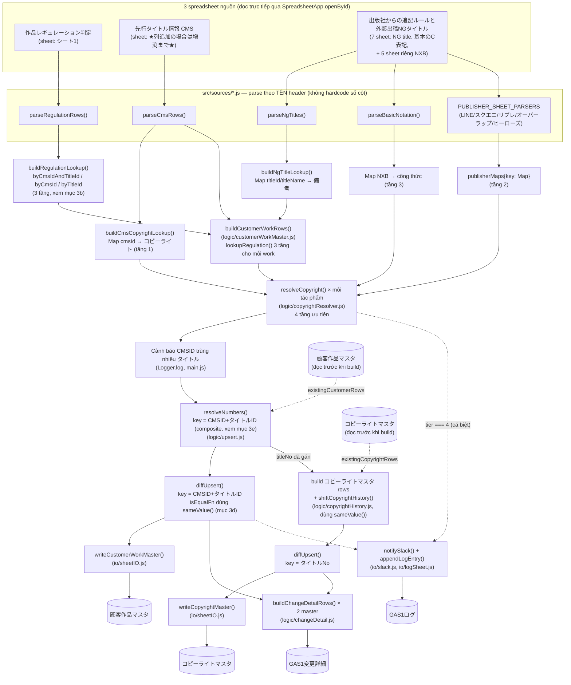
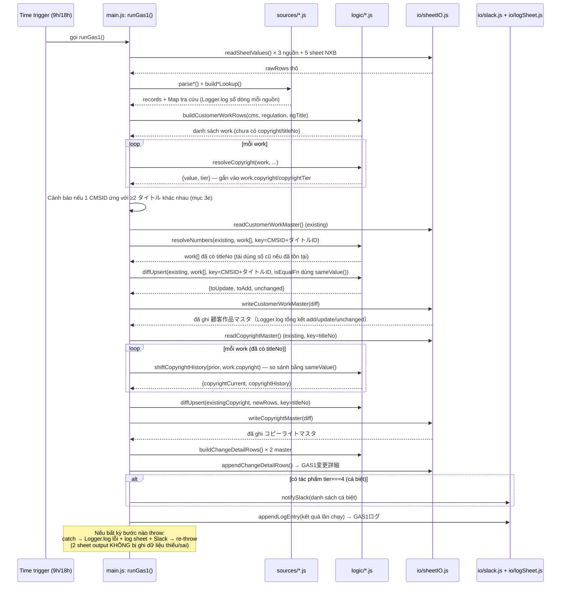

# GAS❶ — Sơ đồ vận hành

Tài liệu này giải thích **luồng dữ liệu** và **thứ tự thực thi** của GAS❶ ở mức tổng quan, để đọc trước khi đi vào từng file code (mỗi function trong `src/` đều có JSDoc chi tiết riêng).

Xem thêm:
- Spec thiết kế: `docs/superpowers/specs/2026-07-17-gas1-customer-copyright-master-design.md`
- Kế hoạch implement: `docs/superpowers/plans/2026-07-17-gas1-customer-copyright-master.md`

## 1. Sơ đồ luồng dữ liệu (data flow)



**Điểm mấu chốt cần nhớ:**

1. **CMS là nguồn nền tảng** — danh sách tác phẩm trong `顧客作品マスタ` hoàn toàn theo CMS; 2 nguồn còn lại chỉ *bổ sung field* cho tác phẩm đã có trong CMS, không tự thêm tác phẩm mới.
2. **Khoá upsert của `顧客作品マスタ` là CMSID + タイトルID (composite)**, không phải タイトルID đơn lẻ (có thể trống/dùng chung placeholder "ー" — mục 3), và cũng không phải CMSID đơn lẻ (vài CMSID bị dùng chung cho 2 tác phẩm khác nhau — mục 3e).
3. **`コピーライトマスタ` không có cột タイトルID riêng** — nó dùng lại đúng `タイトルNo` mà `顧客作品マスタ` vừa gán, nên việc đánh số (`resolveNumbers`) phải xong TRƯỚC khi build `コピーライトマスタ`.
4. **Không bao giờ xoá dòng** — cả 2 sheet chỉ được thêm dòng mới hoặc cập nhật dòng đã đổi.
5. **So sánh "có đổi hay không" luôn qua `sameValue()`**, không dùng `===` trực tiếp — `undefined`/`null`/`''`/khoảng trắng phải được coi là cùng 1 giá trị (mục 3d), nếu không gần như toàn bộ sheet sẽ bị ghi đè lại mỗi lần chạy.

## 2. Thứ tự thực thi trong 1 lần chạy `runGas1()`



## 3. Bài học 1: khoá theo タイトルID đơn lẻ — trống/trùng placeholder

Khi chạy nhiều lần, sheet output bị **trùng dòng ngày càng nhiều**. Nguyên nhân: bản đầu tiên dùng `タイトルID` làm khoá so khớp giữa dữ liệu cũ/mới. Nhưng khi kiểm tra 5649 dòng thật trong `先行タイトル情報(CMS)`:

| Vấn đề | Số liệu |
|---|---|
| タイトルID trống (null) | 197 dòng (~3.5%) |
| タイトルID = placeholder `"ー"` dùng chung cho nhiều tác phẩm khác nhau | ≥ 9 tác phẩm không liên quan |
| CMSID trống | **0 dòng** (trong file gốc "sạch"; file debug sau này lại có CMSID trống — xem mục 3e) |
| CMSID bị lặp (2 dòng khác nhau cùng CMSID) | 4 giá trị (trường hợp hiếm, xem mục 3e) |

Vì nhiều tác phẩm khác nhau cùng rơi vào 1 khoá (`"null"` hoặc `"ー"`), `diffUpsert`/`resolveNumbers` (`logic/upsert.js`) không phân biệt được chúng với dòng đã ghi ở lần chạy trước → bị hiểu nhầm là "tác phẩm mới" → thêm lặp lại mỗi lần chạy. Bước sửa đầu tiên: đổi khoá sang `CMSID` (sau đó lại phải tinh chỉnh thêm — xem mục 3e).

**Ý nghĩa cho việc đọc code:** bất cứ khi nào thấy 1 cột được chọn làm "khoá" (key) để so khớp dữ liệu cũ/mới, hãy tự hỏi "cột này có thể trống hoặc trùng giữa các bản ghi khác nhau không?" trước khi tin tưởng nó.

## 3b. Bài học 2: cùng 1 nguyên tắc, nhưng NGƯỢC HƯỚNG (join 3 tầng ở 作品レギュレーション判定)

Sau khi fix xong khoá upsert, kiểm tra tiếp việc **join** dữ liệu (không phải upsert) giữa `顧客作品マスタ` và sheet `作品レギュレーション判定` (nguồn cung cấp cột ③シーモアロゴ判定) thì phát hiện vấn đề NGƯỢC LẠI với bài học ở mục 3:

| Sheet | CMSID trống | タイトルID trống |
|---|---|---|
| 先行タイトル情報(CMS) | 0% | ~3.5% |
| 作品レギュレーション判定 | **53.6%** (2765/5158 dòng 判定済み) | 15.7% |

Lý do: quy trình phán定 quy định (regulation) nhiều khi được làm dựa trên タイトルID **trước khi** tác phẩm được đăng ký CMS và có CMSID — tức CMSID "đến sau" タイトルID ở sheet này. Bản code đầu tiên chỉ `regulationLookup.get(String(cmsId))` — tra CMS ID duy nhất — nên **bỏ sót âm thầm hơn một nửa** kết quả ③シーモアロゴ判定 (không lỗi, chỉ đơn giản trả về `undefined`).

**Fix:** `regulationSource.js` giờ build 3 map (`byCmsIdAndTitleId`, `byCmsId`, `byTitleId`) và `lookupRegulation()` thử theo đúng thứ tự ưu tiên:

1. Khớp **cả CMS ID lẫn タイトルID cùng lúc** — chắc chắn nhất (2 ID cùng trỏ về đúng 1 bản ghi regulation).
2. Chỉ khớp CMS ID.
3. Chỉ khớp タイトルID.

Dừng ngay ở tầng đầu tiên có kết quả.

**Ý nghĩa cho việc đọc code:** không có "ID chuẩn duy nhất" áp dụng chung cho mọi sheet nguồn — mỗi sheet có đặc điểm trống/trùng khác nhau tuỳ vào quy trình nghiệp vụ tạo ra nó (sheet nào được điền TRƯỚC khi CMS đăng ký sẽ thiếu CMSID; sheet CMS tự nó thì luôn có CMSID). Luôn kiểm tra dữ liệu thật (`example/*.xlsx`) trước khi quyết định khoá join, thay vì giả định.

## 3c. Bài học 3: lọc "dòng có dữ liệu" phải theo ĐÚNG khoá đang dùng, không lẫn khoá cũ

Sau khi đổi khoá upsert của `顧客作品マスタ` sang CMSID (mục 3), dòng vẫn tiếp tục bị trùng lặp. Nguyên nhân: `sheetIO.readCustomerWorkMaster()` (hàm đọc "dữ liệu đang có trên sheet") vẫn dùng dòng code cũ:

```js
if (!row[colTitleId]) continue; // SAI — vẫn lọc theo タイトルID
```

Vì ~3.5% tác phẩm có タイトルID trống, các dòng ĐÃ GHI của những tác phẩm đó bị hàm này **bỏ qua** mỗi lần đọc lại `existingCustomerRows` — `diffUpsert` tưởng chúng "chưa từng tồn tại" → thêm lặp lại vô hạn, dù khoá upsert (`customerKeyFn`) đã đúng là CMSID từ trước đó.

**Fix:** đổi điều kiện lọc sang `if (!row[colCmsId]) continue;` — khớp với field thực sự dùng làm khoá.

**Ý nghĩa cho việc đọc code:** đổi khoá upsert ở 1 chỗ (`customerKeyFn`) KHÔNG đủ — phải rà lại MỌI nơi khác đang ngầm định "field nào coi là định danh dòng", kể cả những chỗ tưởng như không liên quan (ở đây là điều kiện lọc dòng trống khi đọc sheet).

## 3d. Bài học 4: `undefined` ≠ `''` trong JavaScript — nhưng trông giống hệt nhau trên sheet

Sau khi 2 fix trên có hiệu lực, `GAS1変更詳細` vẫn phình to bất thường: **~8954 dòng chỉ sau 2 lần chạy**, ~97% trong số đó (5639 dòng `備考` + 3022 dòng `③シーモアロゴ判定`) hiện cả `変更前` LẪN `変更後` đều **trống**.

Nguyên nhân: khi 1 field vừa build lại không match được gì (vd `lookupRegulation()` trả về `undefined`), giá trị đó là `undefined` trong JS. Nhưng khi GHI `undefined` vào 1 ô Google Sheets rồi ĐỌC LẠI ở lần chạy sau, Sheets trả về **chuỗi rỗng `''`**, không phải `undefined`. So sánh trực tiếp bằng `===` sẽ thấy `undefined !== ''` và coi đó là "đã đổi" — dù cả 2 đều thực chất là "không có gì". Bug này khiến `customerIsEqualFn`/`copyrightIsEqualFn` (main.js), `shiftCopyrightHistory` (copyrightHistory.js), và `buildChangeDetailRows` (changeDetail.js) đồng loạt hiểu sai, ghi đè lại gần như TOÀN BỘ sheet ở mỗi lần chạy.

**Fix:** thêm `normalizeForCompare()`/`sameValue()` (`logic/upsert.js`) — coi `undefined`, `null`, chuỗi rỗng, và chuỗi chỉ có khoảng trắng là CÙNG 1 giá trị "không có gì" (cũng trim khoảng trắng đầu/cuối để loại luôn nhiễu do copy-paste). Áp dụng `sameValue()` ở MỌI nơi so sánh giá trị field cũ/mới, thay cho `===`.

**Ý nghĩa cho việc đọc code:** không bao giờ so sánh trực tiếp `===` giữa 1 giá trị vừa tính trong bộ nhớ (có thể là `undefined`/`null`) với 1 giá trị đọc lại từ Google Sheets (luôn là `''` cho ô trống, không bao giờ là `undefined`/`null`). Luôn chuẩn hoá cả 2 vế trước khi so sánh.

## 3e. Bài học 5: CMSID cũng có thể KHÔNG duy nhất — 2 tác phẩm chung 1 CMSID

Sau 2 fix ở mục 3c/3d, `GAS1変更詳細` giảm mạnh nhưng vẫn còn đúng 3 dòng "cứng đầu" — field bị nhảy qua nhảy lại giữa 2 giá trị ở MỖI lần chạy (không hội tụ). Cả 3 đều trùng khớp với các CMSID đã biết là bị dùng chung cho 2 tác phẩm khác nhau trong dữ liệu thật:

| CMSID | Tác phẩm 1 | Tác phẩm 2 |
|---|---|---|
| 6181 | 神様の花嫁 (フルカラー) — タイトルID 301405 | 神様の花嫁 【タテヨミ】— タイトルID 301406 |
| 6500 | ネトラレ配信妻 — タイトルID 339502 | (dòng ghi taxIt "4014行目と同一" thay vì タイトルID thật) |
| 6530 | 二人一組になってください（コミック）分冊版 — 2 dòng nguồn, 1 dòng ghi "4415行目と同一" | |

Vì `customerKeyFn` khi đó chỉ là `String(cmsId)`, 2 tác phẩm khác nhau bị collision vào ĐÚNG 1 khoá. `diffUpsert`/`resolveNumbers` chỉ "nhớ" được 1 trong 2 (Map ghi đè lẫn nhau), nên dữ liệu của 2 tác phẩm liên tục tráo đổi vị trí giữa các lần chạy — không phải trùng dòng vô hạn như bug ở mục 3, mà là 1 dòng vật lý flip-flop nội dung.

**Fix:** đổi `customerKeyFn` sang khoá GHÉP `String(cmsId) + '|' + String(titleId || titleName || '')` — tách 2 tác phẩm cùng CMSID nhưng khác タイトルID thành 2 khoá riêng biệt, ổn định. Đồng thời thêm cảnh báo (`Logger.log`) khi 1 CMSID vẫn ứng với ≥2 タイトル khác nhau sau khi ghép khoá — đây LÀ lỗi dữ liệu nguồn thật sự (2 dòng CMS dùng chung 1 CMSID), GAS không tự quyết định được cái nào đúng, cần con người vào sheet nguồn kiểm tra/sửa.

**Lưu ý khi đã có dữ liệu cũ bị collision:** nếu sheet output đã có sẵn 2 dòng vật lý nhưng CẢ HAI vô tình cùng mang nội dung của 1 tác phẩm (do bug cũ), đổi khoá KHÔNG tự "chữa lành" — cần xoá sạch dữ liệu output và chạy lại từ đầu để mỗi tác phẩm được tạo đúng 1 dòng riêng ngay từ lần đầu.

**Ý nghĩa cho việc đọc code:** ngay cả 1 ID tưởng như "chắc chắn duy nhất" (CMSID — hệ thống quản lý trung tâm cấp ID) vẫn có thể bị dùng trùng do lỗi nhập liệu thủ công. Khi thiết kế khoá cho dữ liệu do con người nhập tay, cân nhắc khoá ghép (composite key) thay vì tin tưởng tuyệt đối 1 cột duy nhất, và LUÔN log cảnh báo khi phát hiện trùng lặp bất thường thay vì âm thầm chọn 1 trong 2.

## 4. Bảng tra nhanh: file nào làm việc gì

| File | Vai trò | Chạy được ở đâu |
|---|---|---|
| `src/config.js` | ID spreadsheet, tên sheet, hằng số | Cả 2 (không có logic) |
| `src/util/headerMap.js` | Dò hàng header + tra cột theo tên | Cả 2 |
| `src/sources/regulationSource.js` | Parse 作品レギュレーション判定 (3-tier lookup) | Cả 2 |
| `src/sources/cmsSource.js` | Parse 先行タイトル情報(CMS) | Cả 2 |
| `src/sources/ngTitleSource.js` | Parse 外部出稿用NGタイトル | Cả 2 |
| `src/sources/copyrightRules.js` | Parse 基本のC表記 + 5 sheet NXB riêng | Cả 2 |
| `src/logic/customerWorkMaster.js` | Ghép 3 nguồn thành work list | Cả 2 |
| `src/logic/copyrightResolver.js` | Logic 4 tầng bản quyền | Cả 2 |
| `src/logic/upsert.js` | Diff cũ/mới + đánh số ổn định + `sameValue()` | Cả 2 |
| `src/logic/copyrightHistory.js` | Dịch chuyển lịch sử CopyRight過去1-10 | Cả 2 |
| `src/logic/changeDetail.js` | Tính diff field-by-field cho log audit | Cả 2 |
| `src/io/sheetIO.js` | Đọc/ghi 2 sheet output thật (lọc theo CMSID) | **Chỉ Apps Script** |
| `src/io/slack.js` | Gửi cảnh báo Slack | **Chỉ Apps Script** |
| `src/io/logSheet.js` | Ghi log GAS1ログ + GAS1変更詳細 | **Chỉ Apps Script** |
| `src/main.js` | Điều phối toàn bộ + trigger + Logger.log tiến trình + hàm probe debug | **Chỉ Apps Script** |

"Cả 2" nghĩa là hàm thuần JS, không đụng `SpreadsheetApp`/`UrlFetchApp`/`PropertiesService` — về mặt kỹ thuật chạy được cả trong Node lẫn Apps Script, dù project này hiện không có bộ test Node (đã bỏ theo yêu cầu, chỉ debug tay trong Apps Script editor).

## 5. 2 sheet log — dùng khi nào

Mỗi lần `runGas1()` chạy, GAS❶ ghi vào **2 tab riêng biệt** trong spreadsheet `顧客作品マスタ` (tự tạo nếu chưa có):

| Sheet | 1 dòng = | Dùng để |
|---|---|---|
| `GAS1ログ` | 1 LẦN CHẠY | Biết NHANH lần chạy nào thành công/thất bại, tổng số dòng thêm/sửa, có tác phẩm cá biệt không |
| `GAS1変更詳細` | 1 FIELD của 1 tác phẩm đã đổi | BACKUP/AUDIT — tra ngược lại khi phát hiện vấn đề: field nào, tác phẩm nào, đổi từ giá trị gì sang giá trị gì, lúc nào |

`GAS1変更詳細` chỉ ghi field mà GAS❶ **đang thực sự theo dõi**:
- 顧客作品マスタ: 作家名, ジャンル, 出版社, ③シーモアロゴ判定, 備考, コピーライト
- コピーライトマスタ: 正規コピーライト

**Chưa gồm** ①広告出稿ポリシー（出稿NG）/②一般面出稿NG（アダルト作品扱い） — 2 cột này hiện ngoài phạm vi 顧客作品マスタ (GAS❶ chỉ lấy ③シーモアロゴ判定 từ `作品レギュレーション判定`, theo đúng info.md/spec ban đầu). Nếu sau này cần theo dõi cả 2 cột đó, cần: (1) parse thêm 2 cột này ở `sources/regulationSource.js`, (2) quyết định có thêm cột mới vào `顧客作品マスタ` hay chỉ dùng để log/cảnh báo mà không lưu vào master.

Slack (`notifySlack()`) KHÔNG gửi chi tiết field-by-field này — chỉ báo tổng số tác phẩm cá biệt (tầng 4) hoặc lỗi runtime, để tránh tin nhắn quá dài. Muốn xem chi tiết từng field đổi, mở sheet `GAS1変更詳細`.

Không có sheet log riêng cho "tác phẩm mới thêm" (đã cân nhắc và quyết định bỏ — xem commit "Decide against a separate new-addition log sheet"): khác với "thay đổi" (giá trị CŨ mất đi vĩnh viễn khi bị ghi đè), tác phẩm mới vẫn còn nguyên trong chính `顧客作品マスタ`, không cần backup riêng — `addedCount` trong `GAS1ログ` đã đủ biết số lượng.

## 6. Execution log (`Logger.log`) khi chạy tay

`runGas1()` gọi `Logger.log()` ở mọi mốc quan trọng, để tab **Execution log** (Ctrl+Enter / View → Executions trong Apps Script editor) không còn trống khi chạy thành công — trước đây chỉ các hàm `probe_*` mới log, nên chạy `runGas1()` xong mà không xem sheet thì không biết gì đã xảy ra. Thứ tự log xuất hiện:

1. `GAS❶ 開始: <thời điểm>`
2. Số dòng đọc được của từng nguồn (`作品レギュレーション判定`, `先行タイトル情報(CMS)` kèm số dòng bị **skip do CMSID欠落** — xem mục 3e/3c, `外部出稿用NGタイトル`, `基本のC表記`, và từng sheet trong 5 sheet NXB riêng)
3. Cảnh báo (nếu có) khi 1 CMSID ứng với ≥2 タイトル khác nhau
4. `顧客作品マスタ 集計: 追加 N / 更新 N / 変化なし N`
5. `コピーライトマスタ 集計: 追加 N / 更新 N / 変化なし N`
6. Danh sách tác phẩm cá biệt (nếu có)
7. `顧客作品マスタ・コピーライトマスタへの書き込み完了`
8. `GAS1変更詳細 記録: N フィールド分`
9. `GAS❶ 完了: <thời điểm>（所要 N秒）`

Nếu lỗi giữa chừng: `GAS❶ エラーで中断: <lý do>` trước khi script dừng (và vẫn ghi vào `GAS1ログ` + Slack trước khi re-throw).

**Mẹo kiểm tra fix có đúng không:** chạy `runGas1()` 2 lần liên tiếp không sửa gì — lần 2 phải cho `更新 0` (hoặc rất gần 0) và `GAS1変更詳細` gần như trống. Nếu vẫn thấy field nào đó lặp lại đúng "trống → trống" hoặc nhảy qua nhảy lại giữa 2 giá trị mỗi lần chạy, đó là dấu hiệu của đúng 2 loại bug ở mục 3d/3e — kiểm tra dữ liệu nguồn cho tác phẩm đó trước khi nghi ngờ logic.
