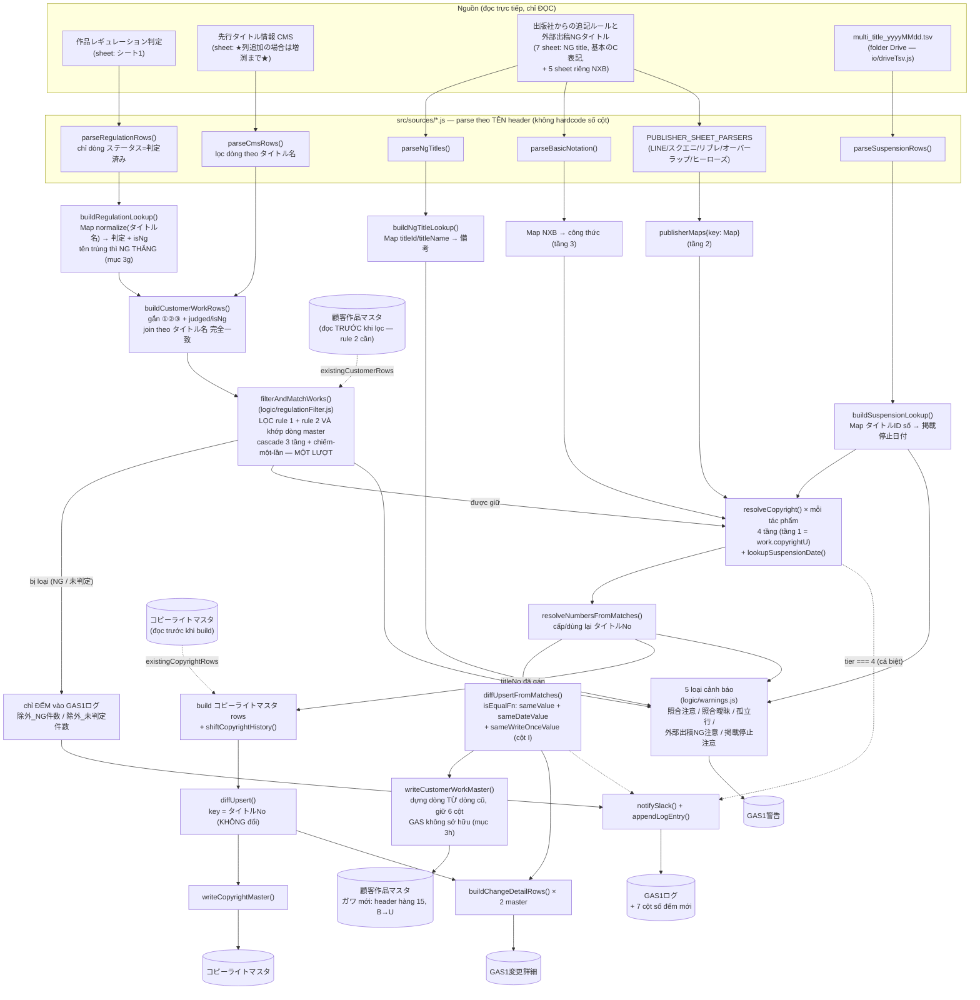
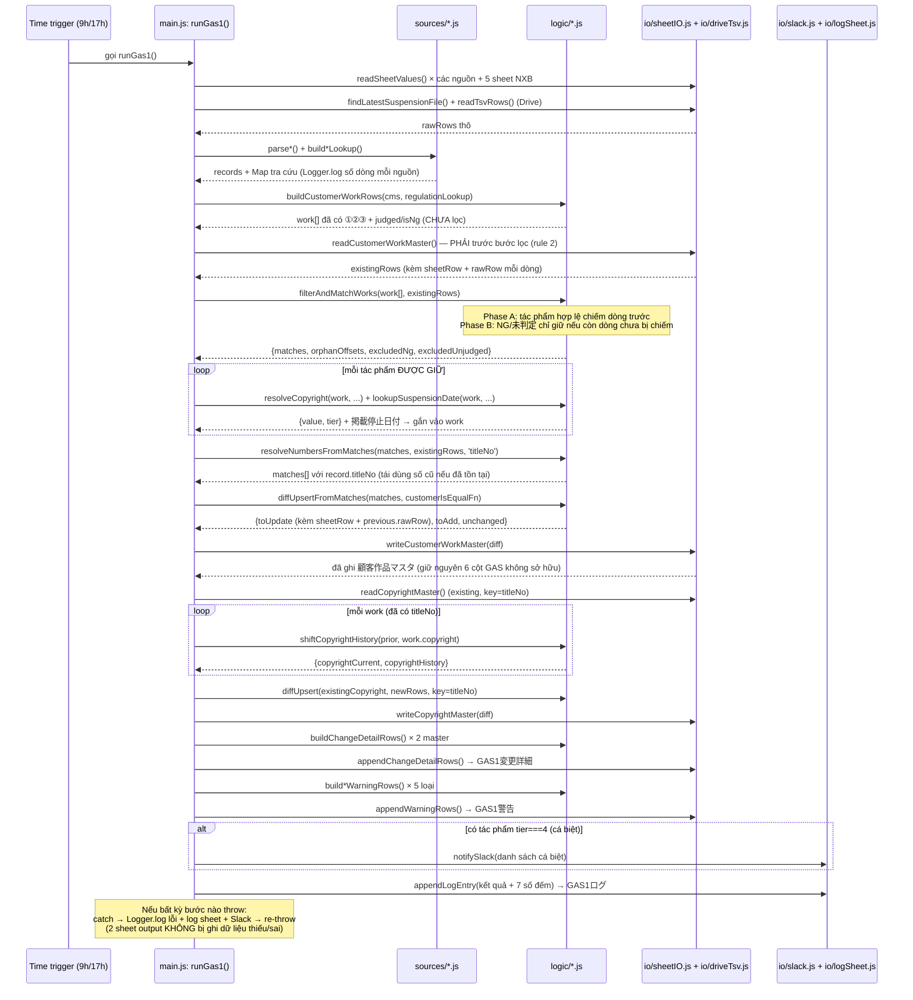

# GAS❶ — Sơ đồ vận hành

Tài liệu này giải thích **luồng dữ liệu** và **thứ tự thực thi** của GAS❶ ở mức tổng quan, để đọc trước khi đi vào từng file code (mỗi function trong `src/` đều có JSDoc chi tiết riêng).

Xem thêm:
- Spec thiết kế: `docs/superpowers/specs/2026-07-17-gas1-customer-copyright-master-design.md`
- Kế hoạch implement: `docs/superpowers/plans/2026-07-17-gas1-customer-copyright-master.md`

## 1. Sơ đồ luồng dữ liệu (data flow)

> Cập nhật 2026-08-03: `作品レギュレーション判定` đã đổi vai trò từ "cấp 1 cột" thành **BỘ LỌC**, khoá upsert đổi sang **cascade 3 tầng** (bỏ CMSID khỏi logic), `顧客作品マスタ` dùng **ガワ mới** (header hàng 15, cột B→U), và có thêm nguồn TSV trên Drive cho cột `掲載停止日付`. Xem spec `docs/superpowers/specs/2026-08-03-regulation-title-name-key-design.md`.



**Điểm mấu chốt cần nhớ:**

1. **CMS quyết định tác phẩm nào TỒN TẠI, レギュレーション quyết định tác phẩm nào ĐƯỢC VÀO master.** Trên dữ liệu 2026-08-04: 5.678 tác phẩm CMS → **1.730 vào master** (30,5%), 595 bị loại vì NG, 3.353 bị loại vì 未判定. Đây là thay đổi lớn nhất so với bản trước (trước đây mọi tác phẩm CMS đều vào master).
2. **`未判定` KHÔNG đồng nghĩa với "không có vấn đề"** mà là "đang chấm, hãy chờ" — theo đúng ghi chú ô B3 của sheet nguồn: `それ以外は判定中のためお待ちください`. Vì vậy tác phẩm chưa có phán định bị loại, không phải cho qua.
3. **Rule 2 — không bao giờ xoá:** tác phẩm ĐÃ CÓ trên master mà sau đó chuyển NG thì được GIỮ NGUYÊN DÒNG, chỉ cập nhật cột F/G/H (`削除等はしない`). Bộ lọc chỉ áp cho tác phẩm chưa có.
4. **Khoá upsert của `顧客作品マスタ` là cascade 3 tầng** (`ID+tên` → `ID số` → `tên`), không còn CMSID — xem mục 3g. CMSID vẫn được GHI vào cột C để tra ngược khi điều tra sự cố, nhưng không tham gia logic nào.
5. **`コピーライトマスタ` không có cột タイトルID riêng** — nó dùng lại đúng `タイトルNo` mà `顧客作品マスタ` vừa gán, nên việc đánh số phải xong TRƯỚC khi build `コピーライトマスタ`.
6. **So sánh "có đổi hay không" luôn qua `sameValue()`/`sameDateValue()`/`sameWriteOnceValue()`**, không dùng `===` trực tiếp (mục 3d/3g).
7. **Cột `掲載停止日付` ghi MỘT LẦN** — ô đã có giá trị thì GAS không bao giờ ghi đè.

## 2. Thứ tự thực thi trong 1 lần chạy `runGas1()`



**3 thứ tự KHÔNG được đảo:**

1. `readCustomerWorkMaster()` phải chạy **trước** `filterAndMatchWorks()` — rule 2 cần biết "tác phẩm này đã có trên master chưa".
2. `filterAndMatchWorks()` phải chạy **trước** `resolveNumbersFromMatches()` — tác phẩm bị loại không được chiếm `タイトルNo`.
3. `resolveNumbersFromMatches()` phải chạy **trước** khi build `コピーライトマスタ` — master đó dùng chung `タイトルNo`.

## 3. Bài học 1: khoá theo タイトルID đơn lẻ — trống/trùng placeholder

Khi chạy nhiều lần, sheet output bị **trùng dòng ngày càng nhiều**. Nguyên nhân: bản đầu tiên dùng `タイトルID` làm khoá so khớp giữa dữ liệu cũ/mới. Nhưng khi kiểm tra 5649 dòng thật trong `先行タイトル情報(CMS)`:

| Vấn đề | Số liệu |
|---|---|
| タイトルID trống (null) | 197 dòng (~3.5%) |
| タイトルID = placeholder `"ー"` dùng chung cho nhiều tác phẩm khác nhau | ≥ 9 tác phẩm không liên quan |
| CMSID trống | **0 dòng** (trong file gốc "sạch"; file debug sau này lại có CMSID trống — xem mục 3e) |
| CMSID bị lặp (2 dòng khác nhau cùng CMSID) | 4 giá trị (trường hợp hiếm, xem mục 3e) |

Vì nhiều tác phẩm khác nhau cùng rơi vào 1 khoá (`"null"` hoặc `"ー"`), `diffUpsert`/`resolveNumbers` (`logic/upsert.js`) không phân biệt được chúng với dòng đã ghi ở lần chạy trước → bị hiểu nhầm là "tác phẩm mới" → thêm lặp lại mỗi lần chạy. Bước sửa đầu tiên: đổi khoá sang `CMSID` (sau đó lại phải tinh chỉnh thêm — xem mục 3e).

**Ý nghĩa cho việc đọc code:** bất cứ khi nào thấy 1 cột được chọn làm "khoá" (key) để so khớp dữ liệu cũ/mới, hãy tự hỏi "cột này có thể trống hoặc trùng giữa các bản ghi khác nhau không?" trước khi tin tưởng nó.

## 3b. Bài học 2: cùng 1 nguyên tắc, nhưng NGƯỢC HƯỚNG (join 3 tầng ở 作品レギュレーション判定)

Sau khi fix xong khoá upsert, kiểm tra tiếp việc **join** dữ liệu (không phải upsert) giữa `顧客作品マスタ` và sheet `作品レギュレーション判定` (nguồn cung cấp cột ③シーモアロゴ判定) thì phát hiện vấn đề NGƯỢC LẠI với bài học ở mục 3:

| Sheet | CMSID trống | タイトルID trống |
|---|---|---|
| 先行タイトル情報(CMS) | 0% | ~3.5% |
| 作品レギュレーション判定 | **53.6%** (2765/5158 dòng 判定済み) | 15.7% |

Lý do: quy trình phán定 quy định (regulation) nhiều khi được làm dựa trên タイトルID **trước khi** tác phẩm được đăng ký CMS và có CMSID — tức CMSID "đến sau" タイトルID ở sheet này. Bản code đầu tiên chỉ `regulationLookup.get(String(cmsId))` — tra CMS ID duy nhất — nên **bỏ sót âm thầm hơn một nửa** kết quả ③シーモアロゴ判定 (không lỗi, chỉ đơn giản trả về `undefined`).

**Fix:** `regulationSource.js` giờ build 3 map (`byCmsIdAndTitleId`, `byCmsId`, `byTitleId`) và `lookupRegulation()` thử theo đúng thứ tự ưu tiên:

1. Khớp **cả CMS ID lẫn タイトルID cùng lúc** — chắc chắn nhất (2 ID cùng trỏ về đúng 1 bản ghi regulation).
2. Chỉ khớp CMS ID.
3. Chỉ khớp タイトルID.

Dừng ngay ở tầng đầu tiên có kết quả.

**Ý nghĩa cho việc đọc code:** không có "ID chuẩn duy nhất" áp dụng chung cho mọi sheet nguồn — mỗi sheet có đặc điểm trống/trùng khác nhau tuỳ vào quy trình nghiệp vụ tạo ra nó (sheet nào được điền TRƯỚC khi CMS đăng ký sẽ thiếu CMSID; sheet CMS tự nó thì luôn có CMSID). Luôn kiểm tra dữ liệu thật (`example/*.xlsx`) trước khi quyết định khoá join, thay vì giả định.

## 3c. Bài học 3: lọc "dòng có dữ liệu" phải theo ĐÚNG khoá đang dùng, không lẫn khoá cũ

Sau khi đổi khoá upsert của `顧客作品マスタ` sang CMSID (mục 3), dòng vẫn tiếp tục bị trùng lặp. Nguyên nhân: `sheetIO.readCustomerWorkMaster()` (hàm đọc "dữ liệu đang có trên sheet") vẫn dùng dòng code cũ:

```js
if (!row[colTitleId]) continue; // SAI — vẫn lọc theo タイトルID
```

Vì ~3.5% tác phẩm có タイトルID trống, các dòng ĐÃ GHI của những tác phẩm đó bị hàm này **bỏ qua** mỗi lần đọc lại `existingCustomerRows` — `diffUpsert` tưởng chúng "chưa từng tồn tại" → thêm lặp lại vô hạn, dù khoá upsert (`customerKeyFn`) đã đúng là CMSID từ trước đó.

**Fix:** đổi điều kiện lọc sang `if (!row[colCmsId]) continue;` — khớp với field thực sự dùng làm khoá.

**Ý nghĩa cho việc đọc code:** đổi khoá upsert ở 1 chỗ (`customerKeyFn`) KHÔNG đủ — phải rà lại MỌI nơi khác đang ngầm định "field nào coi là định danh dòng", kể cả những chỗ tưởng như không liên quan (ở đây là điều kiện lọc dòng trống khi đọc sheet).

## 3d. Bài học 4: `undefined` ≠ `''` trong JavaScript — nhưng trông giống hệt nhau trên sheet

Sau khi 2 fix trên có hiệu lực, `GAS1変更詳細` vẫn phình to bất thường: **~8954 dòng chỉ sau 2 lần chạy**, ~97% trong số đó (5639 dòng `備考` + 3022 dòng `③シーモアロゴ判定`) hiện cả `変更前` LẪN `変更後` đều **trống**.

Nguyên nhân: khi 1 field vừa build lại không match được gì (vd `lookupRegulation()` trả về `undefined`), giá trị đó là `undefined` trong JS. Nhưng khi GHI `undefined` vào 1 ô Google Sheets rồi ĐỌC LẠI ở lần chạy sau, Sheets trả về **chuỗi rỗng `''`**, không phải `undefined`. So sánh trực tiếp bằng `===` sẽ thấy `undefined !== ''` và coi đó là "đã đổi" — dù cả 2 đều thực chất là "không có gì". Bug này khiến `customerIsEqualFn`/`copyrightIsEqualFn` (main.js), `shiftCopyrightHistory` (copyrightHistory.js), và `buildChangeDetailRows` (changeDetail.js) đồng loạt hiểu sai, ghi đè lại gần như TOÀN BỘ sheet ở mỗi lần chạy.

**Fix:** thêm `normalizeForCompare()`/`sameValue()` (`logic/upsert.js`) — coi `undefined`, `null`, chuỗi rỗng, và chuỗi chỉ có khoảng trắng là CÙNG 1 giá trị "không có gì" (cũng trim khoảng trắng đầu/cuối để loại luôn nhiễu do copy-paste). Áp dụng `sameValue()` ở MỌI nơi so sánh giá trị field cũ/mới, thay cho `===`.

**Bổ sung sau đó — biến thể Unicode của ký hiệu ©:** cùng gốc vấn đề, phát hiện thêm dữ liệu bản quyền thật lẫn lộn nhiều ký hiệu "bản quyền" khác nhau về Unicode nhưng giống hệt về ý nghĩa: `©` (U+00A9, chuẩn), `Ⓒ`/`ⓒ` (U+24B8/U+24D2, "circled Latin letter C"), và `(C)`/`(c)` (3 ký tự ASCII). Ví dụ 2 chuỗi copyright chỉ khác đúng 1 ký hiệu này (`©` vs `ⓒ`) bị `sameValue()` (trước khi sửa) coi là "đã đổi", dù nội dung/ý nghĩa giống hệt. `normalizeForCompare()` giờ quy tất cả các biến thể này về cùng 1 dạng `©` **chỉ để so sánh** — giá trị thật sự GHI vào sheet vẫn giữ nguyên ký hiệu gốc từ nguồn.

**Bổ sung thêm — ký tự tiếng Nhật hay bị lẫn lộn khác:**
- `〜` (WAVE DASH, U+301C) vs `～` (FULLWIDTH TILDE, U+FF5E) — 2 ký tự trông giống hệt nhau trong hầu hết font, rất phổ biến trong タイトル名, nhưng Unicode KHÔNG coi là tương đương (kể cả NFKC) — phải tự map thủ công bằng regex.
- Full-width vs half-width Latin/số/khoảng trắng, half-width vs full-width katakana — nhóm này CÓ chuẩn Unicode xử lý sẵn: `String.prototype.normalize('NFKC')`.
- THỨ TỰ áp dụng quan trọng: phải chuẩn hoá © TRƯỚC khi gọi `.normalize('NFKC')`, vì NFKC tự phân rã `Ⓒ`/`ⓒ` thành chữ "C" trần trụi, làm mất dấu hiệu để regex ©-family nhận diện nếu gọi sau.
- CỐ TÌNH KHÔNG chuẩn hoá: gặp dữ liệu thật có ký tự `┴` (ký tự vẽ khung bảng) dùng NHẦM thay cho dấu chấm giữa tên tác giả "・" — đây là lỗi gõ/nhập liệu cần con người sửa ở nguồn, không nên GAS âm thầm coi là tương đương (che mất lỗi thật).

**Ý nghĩa cho việc đọc code:** không bao giờ so sánh trực tiếp `===` giữa 1 giá trị vừa tính trong bộ nhớ (có thể là `undefined`/`null`) với 1 giá trị đọc lại từ Google Sheets (luôn là `''` cho ô trống, không bao giờ là `undefined`/`null`). Luôn chuẩn hoá cả 2 vế trước khi so sánh — và với dữ liệu do nhiều bên nhập tay (đặc biệt tiếng Nhật: ký hiệu ©, dấu ngã 〜/～, full-width/half-width), cân nhắc cả biến thể Unicode tương đương, không chỉ khoảng trắng. Nhưng phân biệt rõ "biến thể hợp lệ nên gộp" với "lỗi gõ cần người sửa" — không phải cái gì trông khác cũng nên tự động coi là giống nhau.

## 3e. Bài học 5: CMSID cũng có thể KHÔNG duy nhất — 2 tác phẩm chung 1 CMSID

Sau 2 fix ở mục 3c/3d, `GAS1変更詳細` giảm mạnh nhưng vẫn còn đúng 3 dòng "cứng đầu" — field bị nhảy qua nhảy lại giữa 2 giá trị ở MỖI lần chạy (không hội tụ). Cả 3 đều trùng khớp với các CMSID đã biết là bị dùng chung cho 2 tác phẩm khác nhau trong dữ liệu thật:

| CMSID | Tác phẩm 1 | Tác phẩm 2 |
|---|---|---|
| 6181 | 神様の花嫁 (フルカラー) — タイトルID 301405 | 神様の花嫁 【タテヨミ】— タイトルID 301406 |
| 6500 | ネトラレ配信妻 — タイトルID 339502 | (dòng ghi taxIt "4014行目と同一" thay vì タイトルID thật) |
| 6530 | 二人一組になってください（コミック）分冊版 — 2 dòng nguồn, 1 dòng ghi "4415行目と同一" | |

Vì `customerKeyFn` khi đó chỉ là `String(cmsId)`, 2 tác phẩm khác nhau bị collision vào ĐÚNG 1 khoá. `diffUpsert`/`resolveNumbers` chỉ "nhớ" được 1 trong 2 (Map ghi đè lẫn nhau), nên dữ liệu của 2 tác phẩm liên tục tráo đổi vị trí giữa các lần chạy — không phải trùng dòng vô hạn như bug ở mục 3, mà là 1 dòng vật lý flip-flop nội dung.

**Fix:** đổi `customerKeyFn` sang khoá GHÉP `String(cmsId) + '|' + String(titleId || titleName || '')` — tách 2 tác phẩm cùng CMSID nhưng khác タイトルID thành 2 khoá riêng biệt, ổn định. Đồng thời thêm cảnh báo (`Logger.log`) khi 1 CMSID vẫn ứng với ≥2 タイトル khác nhau sau khi ghép khoá — đây LÀ lỗi dữ liệu nguồn thật sự (2 dòng CMS dùng chung 1 CMSID), GAS không tự quyết định được cái nào đúng, cần con người vào sheet nguồn kiểm tra/sửa.

**Lưu ý khi đã có dữ liệu cũ bị collision:** nếu sheet output đã có sẵn 2 dòng vật lý nhưng CẢ HAI vô tình cùng mang nội dung của 1 tác phẩm (do bug cũ), đổi khoá KHÔNG tự "chữa lành" — cần xoá sạch dữ liệu output và chạy lại từ đầu để mỗi tác phẩm được tạo đúng 1 dòng riêng ngay từ lần đầu.

**Ý nghĩa cho việc đọc code:** ngay cả 1 ID tưởng như "chắc chắn duy nhất" (CMSID — hệ thống quản lý trung tâm cấp ID) vẫn có thể bị dùng trùng do lỗi nhập liệu thủ công. Khi thiết kế khoá cho dữ liệu do con người nhập tay, cân nhắc khoá ghép (composite key) thay vì tin tưởng tuyệt đối 1 cột duy nhất, và LUÔN log cảnh báo khi phát hiện trùng lặp bất thường thay vì âm thầm chọn 1 trong 2.

## 3f. Bài học 6: fix ở tầng SO SÁNH không tự lan sang tầng TRA CỨU

Sau khi `normalizeForCompare()`/`sameValue()` được thêm để tránh false-positive "đã đổi", 1 lượt `/code-review` phát hiện: các nơi TRA CỨU theo tên tác phẩm/NXB (không phải so sánh cũ-mới) — Tier 2/Tier 3 trong `copyrightResolver.js`, và toàn bộ 6 hàm `parseXxxSheet()` + `resolvePublisherAliasMatch()` trong `copyrightRules.js` — vẫn dùng `.trim()` hoặc `Map.get()` thô, KHÔNG đi qua `sameValue()`/`normalizeForCompare()`.

Hệ quả: nếu CMS ghi tên tác phẩm bằng wave dash `〜` còn sheet bản quyền riêng của NXB ghi bằng fullwidth tilde `～` (hoặc NXB ghi full-width Latin còn CMS ghi half-width), lookup Tier 2/3 **âm thầm miss** — tác phẩm bị rơi xuống tầng thấp hơn hoặc tầng 4 (cá biệt), dù về ý nghĩa 2 tên hoàn toàn giống nhau.

**Fix:** tách `normalizeForCompare()` thành 2 lớp — `normalizeJapaneseText()` (chung, không có phần fold ký hiệu ©, dùng được cho MỌI text tiếng Nhật) và `normalizeForCompare()` (= `normalizeJapaneseText()` + fold ©, chỉ dùng cho field bản quyền). Toàn bộ nơi build/tra Map theo titleName/tên NXB (cả 2 phía — lúc build map lẫn lúc query) đều đổi sang gọi `normalizeJapaneseText()`: 6 hàm `parseXxxSheet()` + `resolvePublisherAliasMatch()` (`sources/copyrightRules.js`), Tier-2/Tier-3 lookup trong `resolveCopyright()` (`logic/copyrightResolver.js`), và `buildNgTitleLookup()` (`sources/ngTitleSource.js`).

Tiện thể fix luôn 1 gap khác cùng đợt review: `（Ｃ）`/`（ｃ）` (ngoặc + chữ C đều full-width — kiểu gõ IME tiếng Nhật rất phổ biến) trước đó KHÔNG được nhận diện tương đương với `©`/`(C)`, vì bước fold © chạy TRƯỚC NFKC (bắt buộc, để không mất dấu hiệu `Ⓒ`/`ⓒ` — xem mục 3d), nhưng full-width→half-width chỉ được NFKC xử lý, quá muộn để quy tắc © bắt lại. Regex © giờ khớp cả 2 dạng ngoặc (full-width lẫn half-width) ngay từ đầu.

**Không sửa (chấp nhận là đánh đổi có chủ đích):** review còn tìm ra 5 điểm khác — dấu ngã fold-về-ASCII-tilde (đã xác nhận không có cách sửa an toàn hơn), `shiftCopyrightHistory` không tự "chữa lành" ký hiệu Unicode cũ khi nguồn đã sửa (đánh đổi để tránh ghi lại sheet không cần thiết), regex `(c)` áp dụng cho mọi field kể cả field không phải bản quyền (rủi ro thấp, không đáng đổi lấy 1 API phức tạp hơn), `headerMap.js` và `logic/upsert.js` vẫn là 2 bộ chuẩn hoá riêng (khác mục đích thật sự — tên cột vs nội dung text), và thứ tự © trước NFKC chỉ được bảo vệ bằng comment (dự án không có test suite theo quyết định trước đó). Xem chi tiết lý do trong `docs/superpowers/plans/2026-07-21-unicode-normalization-lookup-fixes.md`.

**Ý nghĩa cho việc đọc code:** 1 fix ở tầng "so sánh cũ/mới có đổi không" không tự động bảo vệ tầng "tra cứu quy tắc theo tên" — đây là 2 bài toán riêng dùng chung 1 lớp dữ liệu (title/tên NXB), nhưng nằm ở 2 chỗ khác nhau trong pipeline. Khi sửa 1 loại chuẩn hoá text, phải rà lại TẤT CẢ những nơi khác so sánh/khoá cùng loại dữ liệu đó, không chỉ nơi phát hiện ra vấn đề đầu tiên.

## 3g. Bài học 7: khoá không còn trường bất biến thì phải là CASCADE, không phải khoá ghép

Bỏ CMSID khỏi logic (2026-08-03) làm mất trường bất biến duy nhất. Phản xạ đầu tiên là ghép `タイトルID + タイトル名` thành một khoá — nhưng đo trên 1.730 dòng thật thì khoá ghép có **110 dòng sẽ đổi giá trị khoá** (đổi trường nào cũng đổi khoá), mà đổi khoá = sinh dòng trùng.

Cascade 3 tầng (`ID+tên` → `ID số` → `tên`) giữ được cả 1.730 dòng qua 4 lần chạy mô phỏng với **0 dòng trùng**, vì mỗi tầng bắt đúng một kiểu biến động: tầng 2 bắt ca **đổi TÊN** (bỏ dấu 仮), tầng 3 bắt ca **`タイトルID` từ trống/chữ thành SỐ**. Chạy lại `node tools/verify/run.js --data` để kiểm chứng lại bất cứ lúc nào.

Kèm theo cascade là 2 thứ **không thể bỏ**:

- **Chiếm-một-lần**: 2 tác phẩm thật dùng chung `タイトルID` 266030 (`冬すぎて桜` và `冬すぎて桜【タテヨミ】`) sẽ cùng ghi vào 1 dòng ở tầng 2 và **mất 1 record trong im lặng** nếu thiếu ràng buộc này.
- **Điều kiện "cả hai bên đều là số thật" ở tầng 2**: thiếu nó thì mọi dòng `タイトルID` trống khớp lẫn nhau (khoá rỗng = khoá rỗng), và 3 dòng cùng ghi `4415行目と同一` trong ô ID cũng khớp nhau.

Một hệ quả kéo theo dễ bị bỏ sót: **`titleId` và `titleName` phải nằm trong `isEqualFn`**. Nếu không, 110 dòng khớp ở tầng 2/3 bị coi là "không đổi", giá trị định danh mới không bao giờ được ghi, và tầng 2/3 phải chạy lại mỗi ngày mãi mãi.

## 3h. Bài học 8: ghi cả dòng bằng mảng rỗng sẽ XOÁ những cột mình không sở hữu

ガワ mới của `顧客作品マスタ` có 6 cột GAS không ghi (`タイトル区分`, `LP制作`, `先行終了日（延長）`, `（最終確定）`, `大量無料開始日/終了日`) — có cột người điền tay, có cột chờ nguồn dữ liệu chưa tồn tại. Cách ghi cũ (`new Array(columnCount).fill('')` rồi `setValues` cả dòng) sẽ xoá trắng cả 6 cột đó **mỗi lần dòng bị update** — không có lỗi nào để nhận ra, chỉ là dữ liệu người ta nhập tự nhiên biến mất sau 9h sáng.

Cách đúng: dựng dòng ghi **từ bản copy của dòng cũ** (`previous.rawRow`) rồi chỉ ghi đè các cột GAS sở hữu. Lợi thêm: cột do 池永 thêm về sau cũng tự động được giữ, không cần sửa code.

Cột `掲載停止日付` là biến thể của cùng ý tưởng nhưng ở mức "ghi một lần": GAS **có** điền, nhưng chỉ khi ô đang trống (`sameWriteOnceValue`). Nhờ vậy giá trị gõ tay không bị mất, và cột đó cũng không thể gây churn khi định dạng ngày của nguồn khác định dạng Sheets lưu.

## 3i. Bài học 9: đổi bộ lọc dòng thì phải đo lại xem mình vừa nhận thêm gì

Đổi bộ lọc dòng CMS từ `CMSID rỗng → bỏ` sang `タイトル名 rỗng → bỏ` (spec §5.5) làm tổng số record tăng từ 5.649 lên **5.678**. 29 dòng chênh lệch **không phải tác phẩm thật**: chúng là dòng **lệch cột** trong file nguồn — ô `タイトルID` chứa chuỗi copyright (`©Kim.PD/Active Volcano/TOPTOON`), ô `タイトル名` chứa nội dung あらすじ.

Bộ lọc CMSID cũ vô tình chặn được đám này. Hiện cả 29 dòng đều `未判定` nên không dòng nào vào master, nhưng bài học là: **một bộ lọc "dòng có dữ liệu" cũng đang âm thầm làm việc kiểm tra tính toàn vẹn**, nên khi đổi nó thì phải đo lại chênh lệch chứ đừng chỉ nhìn con số cuối. `main.js` giờ log riêng số dòng "có tên nhưng không có CMSID" để đám này không lẫn im lặng vào `除外_未判定件数`.

## 4. Bảng tra nhanh: file nào làm việc gì

`src/` gồm **7 file, chia theo VẤN ĐỀ chứ không theo tầng kỹ thuật** (gom lại 2026-08-04 từ 19 file nhỏ — cấu trúc `sources/` `logic/` `io/` `util/` cũ đã bỏ):

| File | Vấn đề nó lo | Chạy được ở đâu |
|---|---|---|
| `src/config.js` | Cấu hình: ID spreadsheet, tên sheet, folder Drive, giờ chạy | Cả 2 (không có logic) |
| `src/common.js` | **Nền tảng**: (1) tra cột theo TÊN header + tự dò hàng header (+ `columnLetterToIndex` cho nguồn TSV không có header đáng tin), (2) chuẩn hoá/so sánh giá trị (`sameValue`, `sameDateValue`, `sameWriteOnceValue`, `isDigits`) | Cả 2 |
| `src/sources.js` | **Đọc 4 nguồn**: レギュレーション (bộ lọc + ①②③), CMS (danh sách tác phẩm), 外部出稿NGタイトル (cảnh báo), TSV 掲載停止日付 | Cả 2 |
| `src/master.js` | **Nghiệp vụ 顧客作品マスタ** — 4 phần: build work → LỌC + khoá cascade 3 tầng → diff/đánh số → cảnh báo & audit từng field | Cả 2 |
| `src/copyright.js` | **Bản quyền** — 3 phần: parse quy tắc NXB → resolve 4 tầng → lịch sử CopyRight過去 | Cả 2 |
| `src/io.js` | **Chỗ duy nhất nói chuyện với Google** — 4 phần: 2 sheet output, Drive TSV, 3 tab log, Slack | **Chỉ Apps Script** |
| `src/main.js` | Điều phối toàn bộ + trigger + `Logger.log` tiến trình + hàm `probe_*` | **Chỉ Apps Script** |

"Cả 2" nghĩa là hàm thuần JS, không đụng `SpreadsheetApp`/`DriveApp`/`UrlFetchApp`/`PropertiesService`. **Toàn bộ nhóm này ĐƯỢC TEST bằng Node** (mục 7) — đó cũng là lý do ranh giới quan trọng nhất trong codebase này không phải `sources` vs `logic`, mà là **`io.js` + `main.js` (không test được) vs 4 file còn lại (test được)**. Mọi logic nghiệp vụ mới phải nằm ở nhóm test được.

Mỗi file gộp mở đầu bằng comment liệt kê các PHẦN bên trong, và mỗi phần có banner `// ====...` riêng — tìm bằng cách search tên phần thay vì mở nhiều file.

## 5. 3 sheet log — dùng khi nào

Cả 3 đều là tab **trong chính spreadsheet `顧客作品マスタ`**, tự tạo ở lần chạy đầu nếu chưa có.

| Tab | 1 dòng = | Dùng khi |
|---|---|---|
| `GAS1ログ` | 1 LẦN CHẠY | Muốn biết nhanh lần chạy nào thành công/thất bại, và **bao nhiêu tác phẩm bị loại**. Từ 2026-08-03 có thêm 7 cột số đếm: `除外_NG件数`, `除外_未判定件数`, `照合注意件数`, `照合曖昧件数`, `孤立行件数`, `外部出稿NG注意件数`, `掲載停止注意件数`. Header cũ (6 cột) được `ensureLogHeaderRow()` tự nâng cấp, dòng dữ liệu cũ không bị sửa. |
| `GAS1変更詳細` | 1 FIELD của 1 tác phẩm vừa đổi | Cần tra ngược giá trị CŨ (đã bị ghi đè nên mất vĩnh viễn ở master) — field nào, đổi lúc nào, từ gì sang gì. |
| `GAS1警告` | 1 CẢNH BÁO | Cần biết những thứ **không phải lỗi nhưng phải nhìn**: 5 loại `照合注意` / `照合曖昧` / `孤立行` / `外部出稿NG注意` / `掲載停止注意`. |

**Vì sao cảnh báo là tab riêng chứ không nhồi vào 1 ô của `GAS1ログ`:** mô phỏng biến động thật cho **110 ca `照合注意` trong MỘT lần chạy**. Nhồi 110 tên tác phẩm vào một ô thì không ai đọc được, và sẽ đụng giới hạn 50.000 ký tự/ô. 1 dòng = 1 cảnh báo thì lọc/sort/tìm được như dữ liệu bình thường.

**Ý nghĩa 5 loại cảnh báo:**

- `照合注意` — dòng khớp ở **tầng 2 hoặc 3** của cascade, tức một trong hai trường định danh vừa đổi giá trị. Không phải lỗi, nhưng đây cũng chính là hình dạng của một ca khớp SAI (bắt sang dòng láng giềng trùng tên/trùng ID), nên phải thấy được.
- `照合曖昧` — ở tầng thắng có **>1 dòng ứng viên** chưa bị chiếm. GAS chọn dòng có `タイトルNo` nhỏ nhất rồi báo, để người kiểm.
- `孤立行` — dòng master **không record nào chiếm** trong lần chạy này (tác phẩm đổi tên, hoặc bị gỡ khỏi CMS). GAS không xoá, chỉ báo.
- `外部出稿NG注意` — thay cho cột `備考` đã bị bỏ khỏi ガワ. Khoảng 10 tác phẩm mỗi lần chạy.
- `掲載停止注意` — không tìm thấy file TSV, hoặc nhiều tác phẩm dùng chung 1 `タイトルID` nên cùng nhận một ngày dừng.

**KHÔNG có tab riêng cho "tác phẩm mới thêm"**: khác với thay đổi (giá trị cũ mất vĩnh viễn khi bị ghi đè), tác phẩm mới vẫn còn nguyên trong chính `顧客作品マスタ` — lọc theo `タイトルNo` lớn nhất là thấy. Cũng **không có tab liệt kê tác phẩm bị loại**: 3.948 dòng mỗi lần chạy là quá nhiều để log, nên chỉ ghi SỐ LƯỢNG vào `GAS1ログ`; muốn xem danh sách thì chạy `probe_dryRunFilter()`.

## 6. Execution log (`Logger.log`) khi chạy tay

`runGas1()` gọi `Logger.log()` ở mọi mốc quan trọng, để tab **Execution log** (Ctrl+Enter / View → Executions trong Apps Script editor) không còn trống khi chạy thành công. Thứ tự log xuất hiện:

1. `GAS❶ 開始: <thời điểm>`
2. Số dòng đọc được của từng nguồn:
   - `作品レギュレーション判定: N 件（判定済み）読み込み完了、タイトル名ユニーク N 件`
   - `先行タイトル情報(CMS): N 件読み込み完了（タイトル名欠落等でスキップ: N 件、CMSID なしの行: N 件＝列ずれの可能性）` — xem mục 3i
   - `外部出稿用NGタイトル`, `基本のC表記`, từng sheet NXB riêng
   - `掲載停止日付: <tên file>.tsv から N 件読み込み完了` (hoặc thông báo không tìm thấy file)
3. `レギュレーションフィルタ: 対象 N 件 / 除外(NG) N 件 / 除外(未判定) N 件（CMS 全 N 件、既存マスタ N 行）` — **dòng quan trọng nhất**, cho biết bộ lọc vừa làm gì
4. `顧客作品マスタ 集計: 追加 N / 更新 N / 変化なし N / 孤立行 N 行`
5. `コピーライトマスタ 集計: 追加 N / 更新 N / 変化なし N`
6. Danh sách tác phẩm cá biệt (nếu có)
7. `顧客作品マスタ・コピーライトマスタへの書き込み完了`
8. `GAS1変更詳細 記録: N フィールド分`
9. `GAS1警告 記録: N 件（照合注意 N / 照合曖昧 N / 孤立行 N / 外部出稿NG注意 N / 掲載停止注意 N）`
10. `GAS❶ 完了: <thời điểm>（所要 N秒）`

Nếu lỗi giữa chừng: `GAS❶ エラーで中断: <lý do>` trước khi script dừng (và vẫn ghi vào `GAS1ログ` + Slack trước khi re-throw).

**Mẹo kiểm tra fix có đúng không:** chạy `runGas1()` 2 lần liên tiếp không sửa gì — lần 2 phải cho `追加 0` và `更新 0`. `追加 > 0` ở lần 2 nghĩa là khoá upsert đang sinh dòng trùng; `更新` lớn nghĩa là có field bị coi là "đã đổi" ở mọi lần chạy (mở `GAS1変更詳細` xem cột `変更フィールド` nào chiếm đa số — nếu là field ngày thì `sameDateValue` chưa được áp đúng chỗ, xem mục 3g).

## 7. Kiểm chứng bằng Node (từ 2026-08-03)

Toàn bộ tầng pure (`src/sources/*`, `src/logic/*`, `src/util/*`) có test chạy bằng **Node thuần, không cần `npm install`**:

```bash
node tools/verify/run.js            # test đơn vị, ~1 giây
python tools/verify/exportFixtures.py   # export example/*.xlsx -> tools/verify/fixtures/*.json
node tools/verify/run.js --data     # + đối chiếu số liệu thật (spec §12) và mô phỏng 4 lần chạy
```

`tools/verify/run.js` nạp 4 file pure của `src/` vào 1 `vm` context rồi đọc hàm ra từ global object — nhờ vậy **không phải sửa `src/` chỉ để test được** (các file trong `src/` không có `module.exports` vì Apps Script share 1 global scope).

`tools/**` đã bị `.claspignore` loại nên không bị đẩy lên project GAS❶.

**Test dữ liệu (`--data`) khẳng định 4 điều mà mắt thường không kiểm được:**

1. Các con số của bộ lọc khớp spec §12: `判定済み` 5.158 dòng / 5.144 tên duy nhất, tra ra 2.325, **vào master 1.730**, loại NG 595 (アダルト作品扱い 374 + アダルトジャンル 221 + 問題あり 0).
2. Chạy 4 lần liên tiếp trên dữ liệu thật: lần 1 thêm 1.730 → lần 2 **0 thêm / 0 update** → lần 3 (sau biến động 110 dòng đổi định danh) **0 thêm / 110 update**, tầng 1/2/3 = 1.620/2/108 → lần 4 **0 thêm / 0 update**.
3. **0 dòng `タイトルNo` trùng nhau** ở cả 4 lần.
4. 108 + 2 = 110 dòng "sẽ đổi giá trị khoá" là số ĐO ĐƯỢC từ dữ liệu, không phải số cứng — nếu file nguồn đổi, test tự phát hiện lệch.

Nếu một con số không khớp: **đừng sửa expected cho hết đỏ**. Xem hướng dẫn ở đầu hàm `test_dataset` trong `tools/verify/tests.js` — chỉ có 2 khả năng (logic sai, hoặc dữ liệu nguồn đã trôi), và cả 2 đều cần ghi lại con số mới + ngày đo vào spec §12 trước khi sửa test.

## 8. Hàm `probe_*` — chạy thử từng bước, KHÔNG ghi gì

Chọn tên hàm trong dropdown của Apps Script editor rồi Run, xem kết quả ở Execution log. Toàn bộ đều chỉ ĐỌC.

| Hàm | Dùng khi |
|---|---|
| `probe_readCustomerMasterHeader()` | **Chạy đầu tiên sau khi đổi ガワ**: xác nhận GAS dò đúng hàng header (kỳ vọng `15 行目`, `21 列`) và thấy đủ cột bắt buộc |
| `probe_dryRunFilter()` | **Chạy trước lần `runGas1()` đầu tiên**: in ra số vào master / bị loại / phân bố tầng khớp trên dữ liệu LIVE, để đối chiếu với spec §12 trước khi ghi thật |
| `probe_dumpSuspensionTsv()` | Xác nhận tên 2 cột + encoding của file TSV `掲載停止日付` trước khi điền vào `CONFIG.SOURCES.SUSPENSION` |
| `probe_readRegulation()` / `probe_readCms()` / `probe_readNgTitles()` / `probe_readBasicNotation()` / `probe_readPublisherSheets()` | Kiểm 1 nguồn cụ thể khi nghi ngờ nguồn đó lỗi/đổi cấu trúc |
| `probe_readCustomerMaster()` / `probe_readCopyrightMaster()` | Xem GAS đọc được gì từ 2 sheet output |
| `probe_resolveCopyrightForOneWork()` | Debug 1 tác phẩm bị resolve sai tầng bản quyền |
| `probe_appendLogEntry()` / `probe_appendChangeDetailRows()` / `probe_notifySlackNoop()` | Kiểm đường ghi log/Slack (2 hàm đầu CÓ ghi vào tab log — không ghi vào master) |
