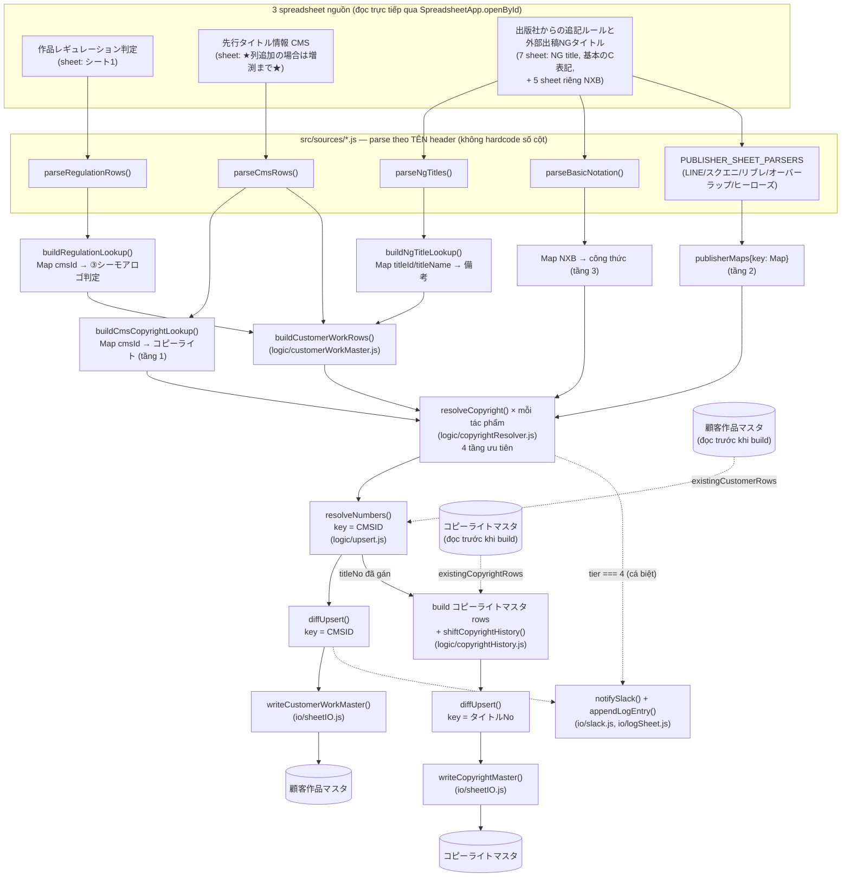
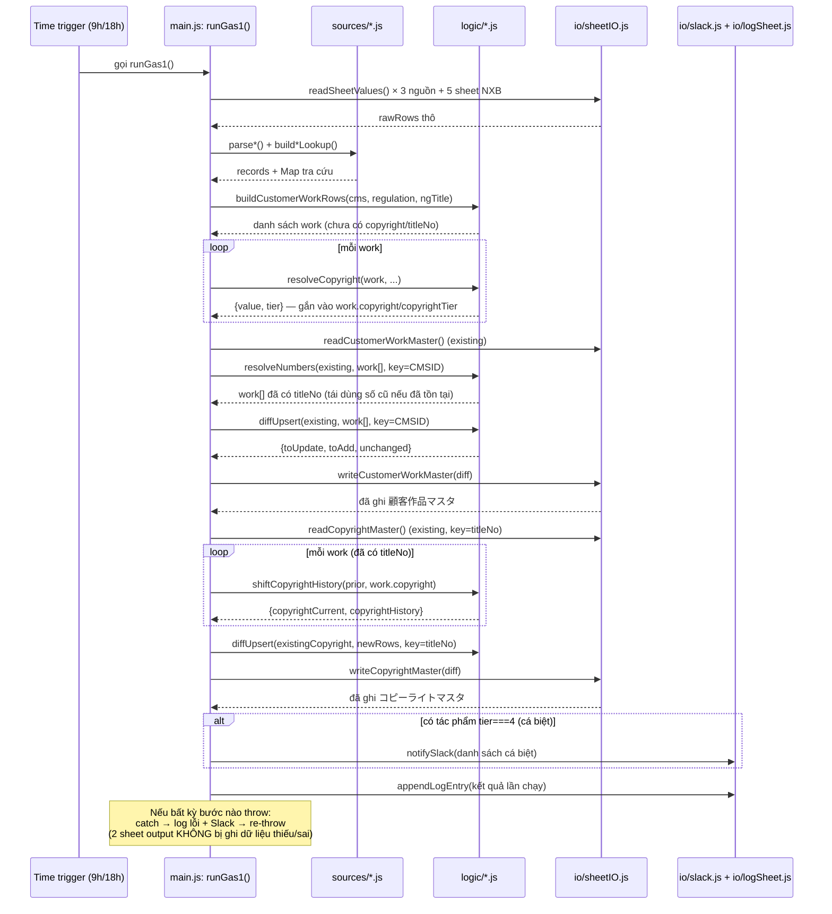

# GAS❶ — Sơ đồ vận hành

Tài liệu này giải thích **luồng dữ liệu** và **thứ tự thực thi** của GAS❶ ở mức tổng quan, để đọc trước khi đi vào từng file code (mỗi function trong `src/` đều có JSDoc chi tiết riêng).

Xem thêm:
- Spec thiết kế: `docs/superpowers/specs/2026-07-17-gas1-customer-copyright-master-design.md`
- Kế hoạch implement: `docs/superpowers/plans/2026-07-17-gas1-customer-copyright-master.md`

## 1. Sơ đồ luồng dữ liệu (data flow)

**Điểm mấu chốt cần nhớ:**

1. **CMS là nguồn nền tảng** — danh sách tác phẩm trong `顧客作品マスタ` hoàn toàn theo CMS; 2 nguồn còn lại chỉ *bổ sung field* cho tác phẩm đã có trong CMS, không tự thêm tác phẩm mới.
2. **Khoá upsert của `顧客作品マスタ` là CMSID**, không phải タイトルID (タイトルID có thể trống hoặc dùng chung placeholder "ー" ở nhiều tác phẩm khác nhau — xem bài học ở mục 3).
3. **`コピーライトマスタ` không có cột タイトルID riêng** — nó dùng lại đúng `タイトルNo` mà `顧客作品マスタ` vừa gán, nên việc đánh số (`resolveNumbers`) phải xong TRƯỚC khi build `コピーライトマスタ`.
4. **Không bao giờ xoá dòng** — cả 2 sheet chỉ được thêm dòng mới hoặc cập nhật dòng đã đổi.

## 2. Thứ tự thực thi trong 1 lần chạy `runGas1()`

## 3. Bài học từ 1 lần debug thật (tại sao khoá = CMSID, không phải タイトルID)

Khi chạy nhiều lần, sheet output bị **trùng dòng ngày càng nhiều**. Nguyên nhân: bản đầu tiên dùng `タイトルID` làm khoá so khớp giữa dữ liệu cũ/mới. Nhưng khi kiểm tra 5649 dòng thật trong `先行タイトル情報(CMS)`:

| Vấn đề | Số liệu |
|---|---|
| タイトルID trống (null) | 197 dòng (~3.5%) |
| タイトルID = placeholder `"ー"` dùng chung cho nhiều tác phẩm khác nhau | ≥ 9 tác phẩm không liên quan |
| CMSID trống | **0 dòng** |
| CMSID bị lặp (2 dòng khác nhau cùng CMSID) | 4 giá trị (trường hợp hiếm, re-đăng ký) |

Vì nhiều tác phẩm khác nhau cùng rơi vào 1 khoá (`"null"` hoặc `"ー"`), `diffUpsert`/`resolveNumbers` (`logic/upsert.js`) không phân biệt được chúng với dòng đã ghi ở lần chạy trước → bị hiểu nhầm là "tác phẩm mới" → thêm lặp lại mỗi lần chạy. Đã sửa bằng cách đổi khoá sang `CMSID` (xem `customerKeyFn` trong `main.js`).

**Ý nghĩa cho việc đọc code:** bất cứ khi nào thấy 1 cột được chọn làm "khoá" (key) để so khớp dữ liệu cũ/mới, hãy tự hỏi "cột này có thể trống hoặc trùng giữa các bản ghi khác nhau không?" trước khi tin tưởng nó.

## 4. Bảng tra nhanh: file nào làm việc gì

| File | Vai trò | Chạy được ở đâu |
|---|---|---|
| `src/config.js` | ID spreadsheet, tên sheet, hằng số | Cả 2 (không có logic) |
| `src/util/headerMap.js` | Dò hàng header + tra cột theo tên | Cả 2 |
| `src/sources/regulationSource.js` | Parse 作品レギュレーション判定 | Cả 2 |
| `src/sources/cmsSource.js` | Parse 先行タイトル情報(CMS) | Cả 2 |
| `src/sources/ngTitleSource.js` | Parse 外部出稿用NGタイトル | Cả 2 |
| `src/sources/copyrightRules.js` | Parse 基本のC表記 + 5 sheet NXB riêng | Cả 2 |
| `src/logic/customerWorkMaster.js` | Ghép 3 nguồn thành work list | Cả 2 |
| `src/logic/copyrightResolver.js` | Logic 4 tầng bản quyền | Cả 2 |
| `src/logic/upsert.js` | Diff cũ/mới + đánh số ổn định | Cả 2 |
| `src/logic/copyrightHistory.js` | Dịch chuyển lịch sử CopyRight過去1-10 | Cả 2 |
| `src/io/sheetIO.js` | Đọc/ghi 2 sheet output thật | **Chỉ Apps Script** |
| `src/io/slack.js` | Gửi cảnh báo Slack | **Chỉ Apps Script** |
| `src/io/logSheet.js` | Ghi log GAS1ログ | **Chỉ Apps Script** |
| `src/main.js` | Điều phối toàn bộ + trigger + hàm probe debug | **Chỉ Apps Script** |

"Cả 2" nghĩa là hàm thuần JS, không đụng `SpreadsheetApp`/`UrlFetchApp`/`PropertiesService` — về mặt kỹ thuật chạy được cả trong Node lẫn Apps Script, dù project này hiện không có bộ test Node (đã bỏ theo yêu cầu, chỉ debug tay trong Apps Script editor).
