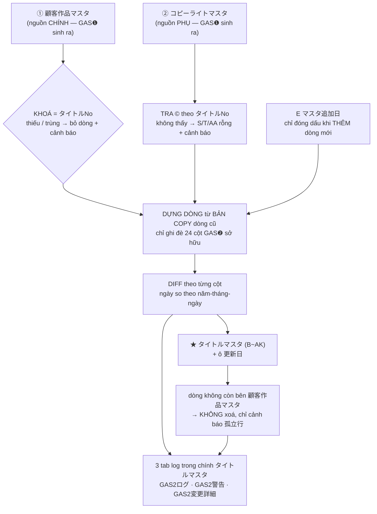

# GAS❷ — Mô tả hiện trạng (bản 2026-08-19)

Bản này mô tả **code đang có trên branch `gas2-title-master`**, không phải spec.

**Một câu:** GAS❷ đọc **2 master do GAS❶ sinh ra**, ghi **24 trong 36 cột** của
`タイトルマスタ` bằng cơ chế diff theo khoá `タイトルNo`, chạy **9:30 và 17:30** giờ Nhật,
hoặc chạy tay `runGas2()` trong Apps Script editor.

Bước trước nó là GAS❶ — xem [gas1-so-do-don-gian.md](gas1-so-do-don-gian.md).

---

## 1. Hình quy trình



## 2. Vào / ra

| Vai trò | Spreadsheet | Sheet |
|---|---|---|
| Nguồn chính (chỉ đọc) | `顧客作品マスタ` `1ILmNpxl…` | `顧客作品マスタ` |
| Nguồn phụ (chỉ đọc) | `コピーライトマスタ` `1lGybYJH…` | `コピーライトマスタ` |
| Output (đọc + ghi) | `タイトルマスタ` `16Fw9Krv…` | `タイトルマスタ` |

GAS❷ **không bao giờ ghi lên 2 master nguồn**.

Layout `タイトルマスタ`: cột A là cột đệm trống, header **hàng 15**, dữ liệu từ **hàng 16**,
dải cột **B~AK**. Ô `更新日` (hiện ở C5) nhận thời điểm chạy.

Không chỗ nào trong code hardcode "hàng 15" hay chữ cái cột — hàng header dò bằng
`findHeaderRowIndex()`, cột tra bằng `col(headerIndex, 'tên cột')`.

## 3. Bảng 24 cột GAS❷ ghi

| Cột | ← Nguồn |
|---|---|
| `B タイトルNo` | 顧客作品マスタ `タイトルNo` — **khoá join** |
| `C CMS ID` / `D タイトルID` | 顧客作品マスタ cùng tên |
| `E マスタ追加日` | **Ngày chạy** — chỉ khi dòng được thêm mới (xem §4) |
| `F タイトル区分` | 顧客作品マスタ `タイトル区分` |
| `G` / `H` / `I` | `①広告出稿ポリシー` / `②一般面出稿NG` / `③シーモアロゴ判定` |
| `J 掲載停止日付` / `K LP制作` / `L タイトル名` | 顧客作品マスタ cùng tên |
| `O 作家名` / `P ジャンル` / `Q 出版社` / `R レーベル名` | 顧客作品マスタ cùng tên |
| `S 出版社コピーライト` | コピーライトマスタ `出版社コピーライト` |
| `T タイトル個別コピーライト(あれば優先使用)` | コピーライトマスタ cùng tên |
| `U`〜`Z` các mốc ngày | 顧客作品マスタ `先行開始日` / `先行終了日` / `先行終了日（延長）` / `先行終了日（最終確定）` / `大量無料開始日` / `大量無料終了日` |
| `AA 出版社事前確認` | コピーライトマスタ `出版社事前確認` |

Toàn bộ là copy nguyên văn, **không có phép biến đổi nào** (trừ `E`). Mọi logic nghiệp vụ —
lọc レギュレーション, sinh 出版社コピーライト, suy `先行終了日（最終確定）`, phán định `LP制作` —
đã nằm ở GAS❶. Quy tắc đổi thì chỉ có một nơi phải sửa.

Bảng này sống ở `TITLE_COLUMNS` trong [gas2/titleMaster.js](../gas2/titleMaster.js).

## 4. `E マスタ追加日` — cột duy nhất GAS❷ tự sinh

Quy tắc: **ngày đưa dòng đó vào master**. Hôm nay GAS❷ thêm dòng thì `E` = hôm nay.

**Write-once:** chỉ ghi đúng một lần, lúc dòng được thêm. Dòng đã có `E` — kể cả giá trị
người nhập tay từ trước — **không bao giờ bị ghi đè**.

Vì sao không ghi lại mỗi lần chạy: `E` là dữ liệu lịch sử, không phải trạng thái. Ghi đè
theo ngày chạy sẽ biến cả cột thành "hôm nay" ngay lần chạy đầu, xoá mất thông tin dòng
nào cũ dòng nào mới — đúng thứ duy nhất cột này dùng để trả lời.

**Hệ quả cần biết:** dòng đã có trên sheet mà `E` đang **trống** thì sẽ trống mãi, vì GAS❷
chỉ đóng dấu lúc thêm dòng. Muốn lấp phải điền tay một lần.

## 5. 12 cột GAS❷ KHÔNG đụng tới

`M タイトルキー`, `N 初回配信巻数`, `AB~AK 掲出可能媒体` (10 cột). Ai nhập tay vào đó thì
giữ nguyên qua mọi lần chạy.

Cơ chế bảo vệ: chúng **vắng mặt khỏi `TITLE_COLUMNS`**, và dòng ghi được dựng từ **bản
copy của dòng cũ**. Không có danh sách "cấm ghi" nào riêng để đi lệch khỏi danh sách kia.
Điều này cũng đúng với cột 池永 thêm về sau mà code chưa biết — nó được giữ nguyên.

Lý do từng cột còn treo:

| Cột | Còn thiếu gì |
|---|---|
| `M タイトルキー` | Hàng 13 của ガワ ghi `制御シート` (nhập tay), ghi chú hàng 29 lại ghi `→GASで更新`. Chưa chốt bên nào. |
| `N 初回配信巻数` | Nguồn là CMS (GAS❷ hiện không đọc CMS) và quy tắc "chỉ lấy số tập cuối" chưa được định nghĩa chính xác. |
| `AB~AK 掲出可能媒体` | Logic ở `媒体除外マスタ` (`ロゴ有無 × ジャンル → 除外媒体`), chưa có spreadsheetId và chưa chốt cách so khớp `ジャンル`. |

## 6. Bốn loại cảnh báo

Không loại nào làm dừng lần chạy. Tất cả vào tab `GAS2警告`, 1 dòng = 1 ca.

| 種別 | Nghĩa | Việc cần làm |
|---|---|---|
| `タイトルNo欠落` | Dòng 顧客作品マスタ không có `タイトルNo` | Kiểm bên GAS❶ vì sao dòng đó không được cấp số |
| `タイトルNo重複` | 2 dòng cùng `タイトルNo`, dòng đầu thắng | Sửa dữ liệu bên 顧客作品マスタ |
| `コピーライト未登録` | `タイトルNo` không có bên コピーライトマスタ → `S`/`T`/`AA` rỗng | Kiểm vì sao GAS❶ không sinh dòng © cho tác phẩm đó |
| `孤立行` | Dòng trên `タイトルマスタ` không còn `タイトルNo` tương ứng bên 顧客作品マスタ | **GAS❷ để nguyên** — người kiểm rồi tự xoá nếu đúng là tác phẩm đã gỡ |

`孤立行` cố ý không bị xoá: GAS❷ không phân biệt được "tác phẩm đã gỡ khỏi master" với
"một lần đọc nguồn ra thiếu dòng". Xoá là không hoàn tác được trên dữ liệu 営業 đang dùng
để chọn tác phẩm; cảnh báo thì người ta xoá tay được.

Riêng `コピーライト未登録` còn được dùng cho một ca khác: `コピーライトマスタ` **chưa có cột**
`出版社事前確認` — khi đó 1 dòng cảnh báo duy nhất được ghi và cột `AA` được giữ nguyên.

## 7. Hai mức lỗi nguồn

- **`顧客作品マスタ` — nguồn CHÍNH.** Đọc không được → dừng ngay, **không ghi một ô nào**,
  ghi 1 dòng `GAS2ログ` có cột `エラー` + bắn Slack.
- **`コピーライトマスタ` — nguồn PHỤ.** Đọc không được → **giữ nguyên** `S`/`T`/`AA` đang có
  trên sheet, lần chạy vẫn tiếp tục cho 21 cột còn lại. Không sinh cảnh báo cho từng dòng
  (nếu không, một lần mất quyền truy cập đẻ ra hàng nghìn dòng cảnh báo vô nghĩa).

Nguồn phụ bắt buộc phải cư xử vậy: `S`/`T` là cột GAS❷ ghi đè hoàn toàn, coi "không đọc
được" = "rỗng" sẽ xoá sạch copyright của toàn bộ tác phẩm chỉ vì một lần mất quyền — mà
copyright sai là đúng loại tai nạn dự án này sinh ra để chặn.

## 8. Ba tab log

Nằm trong **chính spreadsheet `タイトルマスタ`** — đó là chỗ người dùng đang mở khi họ
thắc mắc "sao dòng này đổi".

| Tab | 1 dòng = | Dùng khi |
|---|---|---|
| `GAS2ログ` | 1 lần chạy: giờ bắt đầu/kết thúc, số thêm, số sửa, 4 cột đếm cảnh báo, lỗi | "Sáng nay nó có chạy không? Có lỗi gì không?" |
| `GAS2警告` | 1 cảnh báo: giờ, 種別, `タイトルNo`, `タイトルID`, `タイトル名`, chi tiết | "Tác phẩm này sao không lên master?" |
| `GAS2変更詳細` | 1 cột của 1 tác phẩm đã đổi: giờ, `タイトルNo`, `タイトル名`, tên cột, giá trị cũ, giá trị mới | "Ai đổi ngày kết thúc của tác phẩm này?" |

Lần chạy hoàn toàn sạch thì tab `GAS2警告` và `GAS2変更詳細` **không được tạo** — không có
dòng trống vô nghĩa.

## 9. Chạy và lịch

**Chạy tay:** mở project GAS❷
(`1hI2TqTyvB-D7KEoDSXcWtUx4mCG0HfiG-c5x551ovrGApqWzlEdAJZlU`), chạy `runGas2()`.

**Xem trước khi ghi:** chạy `probe_dryRunDiff()` — nó chạy trọn phần tính toán rồi in ra
sẽ thêm/sửa bao nhiêu dòng, **không ghi gì cả**. Chạy hàm này trước mỗi lần làm gì đó
đáng ngờ. Nếu nó báo sửa gần bằng tổng số dòng ở lần chạy thứ hai liên tiếp thì có churn —
dừng lại, tìm cột nào bị so nhầm kiểu.

Các probe khác, đều không ghi gì: `probe_readTitleMasterHeader()` (xác nhận hàng header +
24 tên cột — chạy nó sau mỗi lần 池永 sửa ガワ), `probe_readCustomerMaster()`,
`probe_readCopyrightMaster()`.

**Lịch:** 9:30 và 17:30 `Asia/Tokyo`, đi sau GAS❶ (9:00/17:00) 30 phút. Cài bằng cách chạy
tay `createGas2Trigger()` **một lần** — đổi `CONFIG.TRIGGER_HOURS` xong phải chạy lại nó,
Apps Script không tự đọc lại.

Trigger hằng ngày của Apps Script chỉ nhận `nearMinute()`, nên Google chạy trong khoảng
**±15 phút** quanh 9:30/17:30. Không có API đặt đúng phút.

Nếu GAS❶ chạy quá 30 phút hoặc lỗi, GAS❷ đọc dữ liệu của lần trước và vẫn chạy thành công
— không có cơ chế chờ. Hệ quả xấu nhất là `タイトルマスタ` trễ nửa ngày, và `GAS1ログ` đã ghi
lại việc GAS❶ lỗi.

## 10. Test

```bash
node tools/verify-gas2/run.js          # 44 test đơn vị
python tools/verify/exportFixtures.py  # export fixture từ example/*.xlsx
node tools/verify-gas2/run.js --data   # thêm nhóm đối chiếu ガワ thật (58 test)
node tools/verify-gas2/smoke.js        # chạy trọn runGas2() trên SpreadsheetApp giả
```

`smoke.js` **không assert gì** — nó in ra mọi lệnh ghi mà `runGas2()` định thực hiện, để
người đọc nhìn. Nó tồn tại vì lỗi của `main.js` là lỗi *nối dây* (gọi sai tên hàm, thiếu
một key của options) mà không test đơn vị nào bắt được, và cách phát hiện duy nhất khác là
push lên rồi bấm chạy vào master thật.

**Giới hạn đã biết:** cả 3 file trong `example/` đều là ガワ chứ không có dữ liệu thật
(`顧客作品マスタ` ra 0 record). Nên nhóm `--data` **không kiểm được số lượng** — nó kiểm 3
danh sách tên cột bắt buộc có khớp byte-chính-xác với 3 sheet thật hay không. Phép kiểm số
lượng thật sự là `probe_dryRunDiff()` trên spreadsheet thật.

## 11. Thêm nguồn cho 1 trong 12 cột còn treo

Ba bước, không cần sửa gì khác:

1. `gas2/config.js` — thêm 1 entry vào `CONFIG.SOURCES`.
2. `gas2/sources.js` — thêm hàm `parse…Rows()` cho nguồn mới, hoặc thêm field vào record
   sẵn có nếu giá trị nằm trên master đang đọc.
3. `gas2/titleMaster.js` — thêm 1 dòng vào `TITLE_COLUMNS` với `header` copy byte-chính-xác
   từ sheet, `source`, `field`, và `compare: 'text' | 'date'`.

## 12. ⚠️ `gas2/common.js` là BẢN COPY

`gas2/common.js` là bản copy của `src/common.js` (Apps Script không cho import chéo
project). **Sửa `src/common.js` thì phải copy lại sang `gas2/common.js`** và cập nhật dòng
ngày ở đầu file. Không có cơ chế nào tự nhắc việc này ngoài dòng ngày đó.
