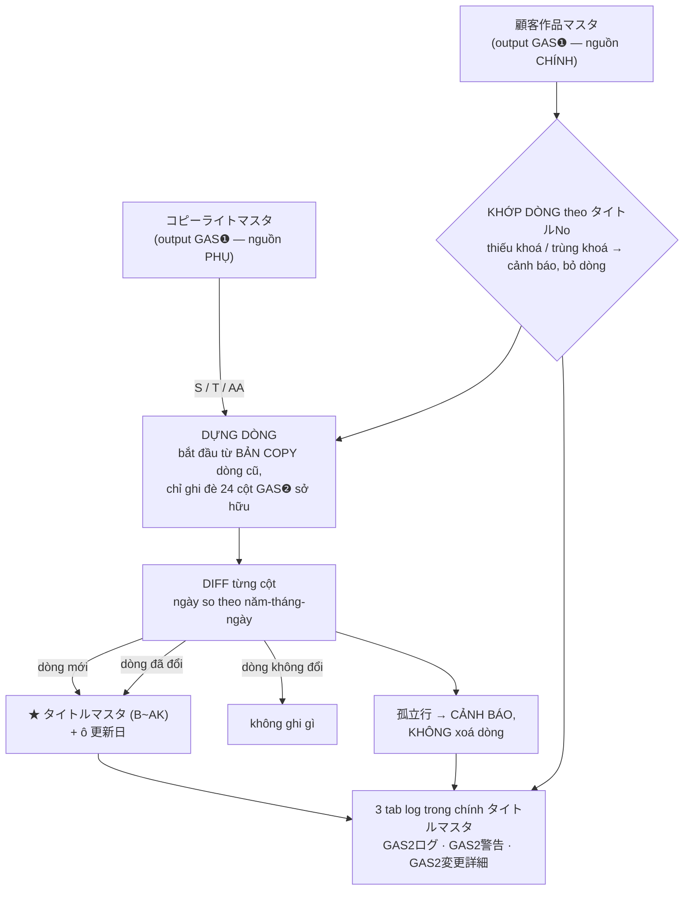

# GAS❷ — Mô tả hiện trạng (bản 2026-08-19)

Bản này mô tả **code đang có trong `gas2/`**, không phải spec. Spec thiết kế nằm ở
`docs/superpowers/specs/2026-08-19-gas2-title-master-design.md`.

**Một câu:** GAS❷ đọc **2 master do GAS❶ sinh ra**, gộp lại rồi ghi **24 trong 36 cột**
của `タイトルマスタ` bằng cơ chế diff theo khoá `タイトルNo`, chạy tự động **9:30 và 17:30**
giờ Nhật, hoặc chạy tay `runGas2()` trong Apps Script editor.

GAS❷ là một **Apps Script project RIÊNG**, không phải một hàm trong GAS❶:
`scriptId 1hI2TqTyvB-D7KEoDSXcWtUx4mCG0HfiG-c5x551ovrGApqWzlEdAJZlU`.

---

## 1. Sơ đồ



## 2. Vào / ra

| Vai trò | Spreadsheet | Sheet |
|---|---|---|
| Nguồn CHÍNH (chỉ đọc) | `1ILmNpxlDIa-J0XiNnRprsdYVcUUiIEt59Miwey214hU` | `顧客作品マスタ` |
| Nguồn PHỤ (chỉ đọc) | `1lGybYJHGeYy7Lzu_8aK9I4DokVLolkBGO-vaVoeO_Dc` | `コピーライトマスタ` |
| Output (đọc + ghi) | `16Fw9KrvKskewy9OAWqPegYXvhOkRPywatd512Ncn4rI` | `タイトルマスタ` |

GAS❷ **không bao giờ ghi lên 2 master nguồn**.

Layout `タイトルマスタ`: cột A là cột đệm trống, **header ở hàng 15**, dữ liệu từ hàng 16,
dải cột B~AK. Ô `C5` là `更新日` (GAS❷ đóng dấu giờ chạy vào đây). Code **không hardcode**
hàng 15 hay chữ cái cột nào — mọi thứ tra theo tên header.

## 3. 24 cột GAS❷ ghi

| Cột | Nguồn |
|---|---|
| B `タイトルNo` | 顧客作品マスタ — **khoá join** |
| C `CMS ID` · D `タイトルID` | 顧客作品マスタ |
| **E `マスタ追加日`** | **GAS❷ tự đóng dấu** — xem §4 |
| F `タイトル区分` | 顧客作品マスタ |
| G `①広告出稿ポリシー` · H `②一般面出稿NG` · I `③シーモアロゴ判定` | 顧客作品マスタ |
| J `掲載停止日付` · K `LP制作` · L `タイトル名` | 顧客作品マスタ |
| O `作家名` · P `ジャンル` · Q `出版社` · R `レーベル名` | 顧客作品マスタ |
| **S `出版社コピーライト`** | コピーライトマスタ |
| **T `タイトル個別コピーライト(あれば優先使用)`** | コピーライトマスタ |
| U〜Z `各種掲出期間` (6 cột) | 顧客作品マスタ |
| **AA `出版社事前確認`** | コピーライトマスタ |

**Không có phép biến đổi nào** — 23 cột là copy nguyên văn. Mọi logic nghiệp vụ (lọc
レギュレーション, sinh 出版社コピーライト, suy `先行終了日（最終確定）`, phán định `LP制作`)
nằm ở GAS❶. GAS❷ cố ý không lặp lại một mảnh nào: quy tắc đổi thì chỉ đúng một nơi phải sửa.

## 4. `E マスタ追加日` — cột duy nhất GAS❷ tự sinh

Giá trị = **ngày dòng đó được thêm vào master**. Đây là cột **write-once**: chỉ đóng dấu
đúng một lần, lúc dòng được append. Dòng đã có `E` thì các lần chạy sau không đụng tới.

Ghi đè mỗi lần chạy sẽ biến cả cột thành "hôm nay" ngay lần đầu, xoá mất thông tin dòng
nào cũ dòng nào mới — đúng thứ duy nhất cột này dùng để trả lời.

**Hệ quả:** dòng đã có trên sheet mà `E` đang trống sẽ **trống mãi**. Muốn lấp phải điền tay.

## 5. 12 cột GAS❷ KHÔNG đụng tới

`M タイトルキー`, `N 初回配信巻数`, `AB~AK 掲出可能媒体` (10 cột). Ai nhập tay vào đó thì
giá trị được giữ nguyên qua mọi lần chạy — kể cả khi dòng bị update.

Cơ chế bảo vệ nằm ở chỗ dòng ghi được **dựng từ bản copy của dòng cũ** rồi mới ghi đè 24
cột GAS❷ sở hữu. Nghĩa là **mọi cột 池永 thêm về sau cũng tự động được giữ**, không phải
sửa code.

Lý do từng cột chưa có nguồn:

- `M タイトルキー` — hàng 13 của ガワ ghi `制御シート` (nhập tay), ghi chú hàng 29 lại ghi
  `→GASで更新`. Hai chỗ mâu thuẫn, chưa chốt.
- `N 初回配信巻数` — nguồn là CMS (GAS❷ hiện không đọc CMS), quy tắc "chỉ lấy số tập cuối"
  chưa được định nghĩa chính xác.
- `AB~AK 掲出可能媒体` — logic ở `媒体除外マスタ` (`ロゴ有無 × ジャンル → 除外媒体`), chưa có
  spreadsheetId và chưa chốt cách so khớp `ジャンル`.

## 6. Cách chạy tay

Mở project GAS❷ trong Apps Script editor.

**Trước lần chạy thật đầu tiên**, chạy 4 probe theo thứ tự — cả 4 **không ghi gì lên sheet**:

| Hàm | Cần thấy gì |
|---|---|
| `probe_readCustomerMaster()` | số dòng đọc được > 0 |
| `probe_readCopyrightMaster()` | `có cột 出版社事前確認: true/false` — quyết định cột AA có được ghi không |
| `probe_readTitleMasterHeader()` | `hàng header (1-based): 15`, 24 dòng map cột, không throw |
| `probe_dryRunDiff()` | in số dòng sẽ thêm/sửa mà không ghi gì |

Rồi `runGas2()`. **Chạy lần thứ hai ngay sau đó**: `追加行数` và `更新行数` phải là **0**.
Đó là bằng chứng không có churn — nếu không phải 0, dừng lại và tìm cột nào bị so nhầm
kiểu trước khi cài trigger.

Cài lịch: chạy `createGas2Trigger()` **một lần**. Nó xoá trigger cũ rồi tạo lại 2 trigger
9h và 17h. Apps Script chỉ có `nearMinute()` cho trigger hằng ngày nên Google chạy trong
khoảng **±15 phút** quanh 9:30/17:30 — không có cách đặt đúng phút.

## 7. Đọc 3 tab log

Cả 3 nằm trong **chính spreadsheet `タイトルマスタ`** — chỗ người ta đang mở khi thắc mắc.

| Tab | Nội dung |
|---|---|
| `GAS2ログ` | 1 dòng/lần chạy: giờ bắt đầu/kết thúc, số thêm, số sửa, 4 cột đếm cảnh báo, lỗi |
| `GAS2警告` | 1 dòng/cảnh báo: giờ, loại, `タイトルNo`, `タイトルID`, `タイトル名`, chi tiết |
| `GAS2変更詳細` | 1 dòng/cột đã đổi: giờ, `タイトルNo`, `タイトル名`, tên cột, giá trị cũ, giá trị mới |

4 loại cảnh báo và việc phải làm:

| Loại | Nghĩa | Làm gì |
|---|---|---|
| `タイトルNo欠落` | Dòng 顧客作品マスタ không có `タイトルNo` | Xem lại GAS❶ — nó phải cấp số cho mọi dòng |
| `タイトルNo重複` | 2 dòng 顧客作品マスタ cùng `タイトルNo` (dòng đầu thắng) | Sửa ở 顧客作品マスタ |
| `コピーライト未登録` | `タイトルNo` không có bên コピーライトマスタ → S/T/AA để rỗng | Xem GAS❶ có bỏ sót tác phẩm không |
| `孤立行` | Dòng `タイトルマスタ` không còn tương ứng bên 顧客作品マスタ | **GAS❷ không xoá** — người kiểm rồi xoá tay nếu đúng |

Cảnh báo `コピーライト未登録` cũng xuất hiện **một dòng không có タイトルNo** khi
`コピーライトマスタ` chưa có cột `出版社事前確認` — nghĩa là cột AA đang được giữ nguyên.
Thêm cột đúng tên đó vào nguồn là đủ để kích hoạt, không phải sửa code.

## 8. Khi nguồn hỏng

| Nguồn | Đọc không được thì sao |
|---|---|
| `顧客作品マスタ` (CHÍNH) | **Dừng ngay, không ghi một ô nào**, ghi lỗi vào `GAS2ログ` + bắn Slack |
| `コピーライトマスタ` (PHỤ) | **Giữ nguyên** S/T/AA đang có trên sheet, lần chạy vẫn tiếp tục |

Nguồn phụ phải cư xử như vậy: S/T là cột GAS❷ ghi đè hoàn toàn, nên coi "không đọc được"
= "rỗng" sẽ xoá sạch copyright của toàn bộ tác phẩm chỉ vì một lần mất quyền truy cập —
mà copyright sai là đúng loại tai nạn dự án này sinh ra để chặn.

Slack: điền 2 Script Property `SLACK_BOT_TOKEN` và `SLACK_CHANNEL_ID` qua
Apps Script editor > Project Settings. Chưa điền thì GAS❷ im lặng bỏ qua, không lỗi.

## 9. Cấu trúc code

```
gas2/
  config.js        3 spreadsheet ID + trigger + tên Script Property của Slack
  common.js        BẢN COPY của src/common.js — xem cảnh báo ở §10
  sources.js       tầng thuần: đọc 2 master nguồn thành record
  titleMaster.js   tầng thuần: TITLE_COLUMNS, dựng dòng, khoá, diff
  io.js            CHỖ DUY NHẤT gọi Google API
  main.js          runGas2(), createGas2Trigger(), 4 probe_*
```

Chạy test: `node tools/verify-gas2/run.js` (thêm `--data` để đối chiếu với ガワ thật —
cần `python tools/verify/exportFixtures.py` trước).

`node tools/verify-gas2/smoke.js` chạy trọn `runGas2()` trên `SpreadsheetApp` giả và in ra
mọi lệnh ghi mà nó định thực hiện. Không assert gì — để người đọc nhìn, dùng khi nghi ngờ
phần dàn dựng.

## 10. Hai điều dễ quên

**`gas2/common.js` là bản copy của `src/common.js`.** Sửa `src/common.js` thì phải copy
lại nguyên file và cập nhật dòng ngày ở đầu. Apps Script không cho project này import
project kia nên không có cách nào tránh.

**Đổi spreadsheetId của 2 master ở GAS❶ thì phải đổi cả ở `gas2/config.js`.** Quên thì
GAS❷ vẫn chạy trơn tru trên master cũ và không có gì báo.

## 11. Thêm nguồn cho 1 trong 12 cột còn treo

Ba bước, không phải sửa lại thiết kế:

1. `gas2/config.js` — thêm 1 entry vào `SOURCES`.
2. `gas2/sources.js` — thêm hàm parse nguồn đó, hoặc thêm field vào record đang có.
3. `gas2/titleMaster.js` — thêm 1 dòng vào `TITLE_COLUMNS` với `header` copy byte-chính-xác
   từ sheet, `source`, `field`, và `compare` (`'date'` hay `'text'`).

Nhớ: `normalizeHeaderText()` **chỉ bỏ khoảng trắng và xuống dòng, KHÔNG làm NFKC** — ngoặc
full-width `（）` và half-width `()` là hai thứ khác nhau. Trên `タイトルマスタ` thật:
`先行終了日（延長）` dùng ngoặc full-width, còn
`タイトル個別コピーライト(あれば優先使用)` dùng half-width.
